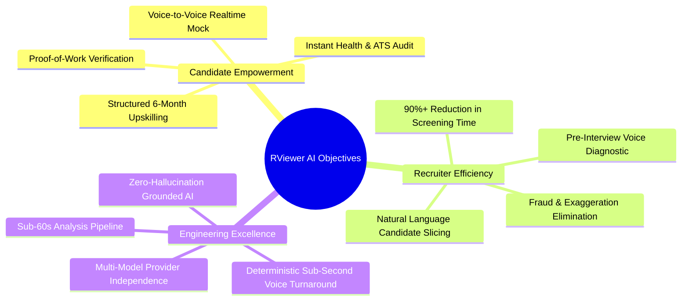
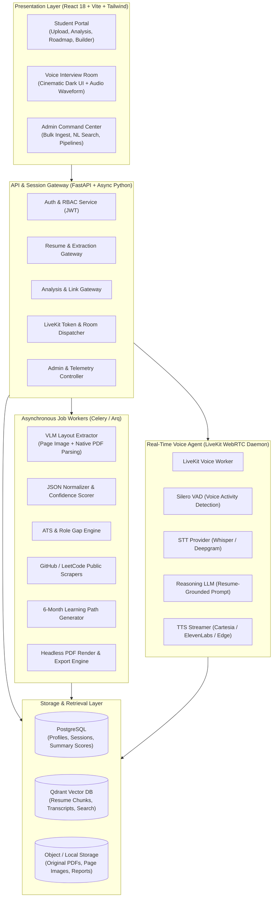
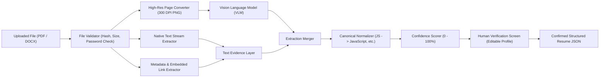
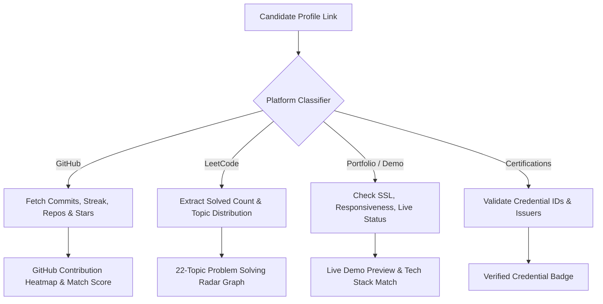
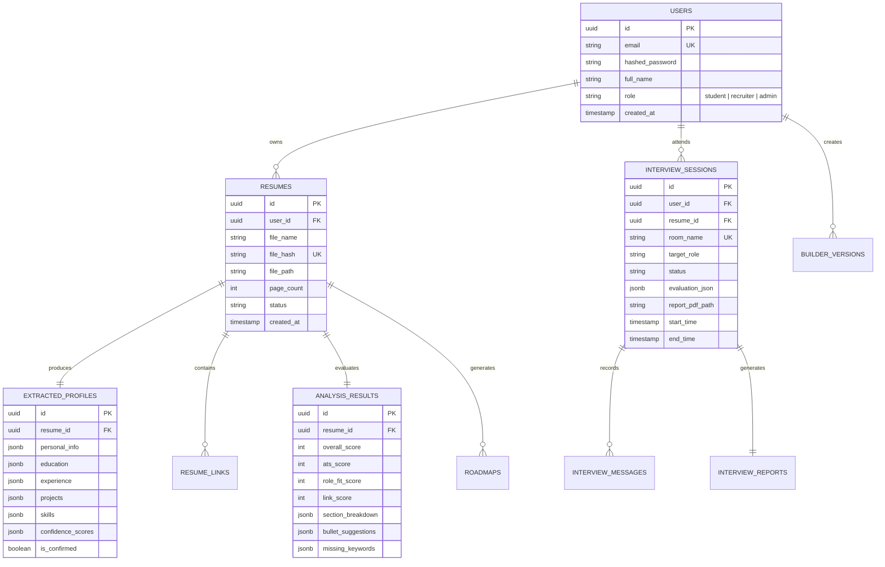
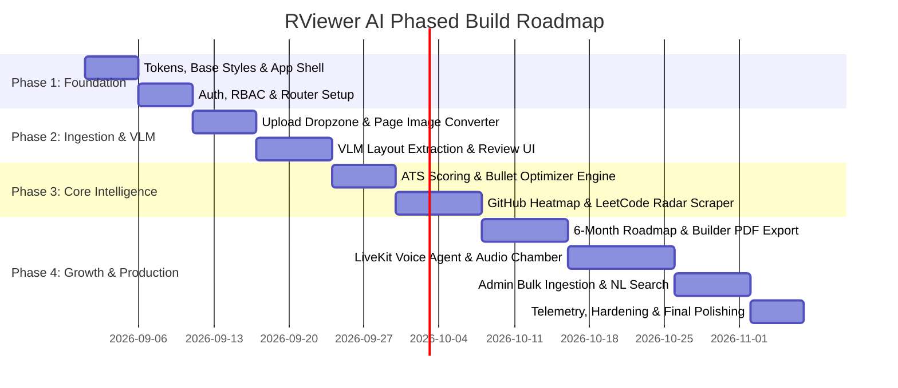

# RViewer AI — Comprehensive Project Presentation & High-Level Build Blueprint

> **Document Version**: 2.0  
> **Classification**: Master Architecture, Presentation & Engineering Blueprint  
> **Audience**: Executive Stakeholders, Product Architects, Engineering Leads, Recruiters & Investors  
> **Source Baseline**: [01-project-prd.md](file:///c:/SSG%20projects/personalhire/docs%20v2/01-project-prd.md), [02-resume-extraction-analysis-module.md](file:///c:/SSG%20projects/personalhire/docs%20v2/02-resume-extraction-analysis-module.md), [03-links-roadmap-resume-builder-module.md](file:///c:/SSG%20projects/personalhire/docs%20v2/03-links-roadmap-resume-builder-module.md), [04-voice-to-voice-interview-module.md](file:///c:/SSG%20projects/personalhire/docs%20v2/04-voice-to-voice-interview-module.md), [05-admin-module-high-level.md](file:///c:/SSG%20projects/personalhire/docs%20v2/05-admin-module-high-level.md), and [06-implementation-ui-build-spec.md](file:///c:/SSG%20projects/personalhire/docs%20v2/06-implementation-ui-build-spec.md).

---

## 1. Executive Summary

**RViewer AI** is an end-to-end, multi-modal **Resume Intelligence and Career Acceleration Platform**. It bridges the gap between candidates (students and job seekers) and hiring teams (recruiters, institutions, and enterprise admins).

Instead of treating a resume as a lifeless PDF lost in an Applicant Tracking System (ATS) "black hole", RViewer AI turns every resume into an **actionable, multi-dimensional, verified career profile**:
1. **Layout-Aware Extraction (VLM + Evidence Layer)** — Reads complex multi-column resumes with zero layout confusion.
2. **Deep Resume & ATS Analysis** — Evaluates keyword alignment, bullet impact, completeness, and role compatibility.
3. **Link Intelligence & Proof-of-Work Verification** — Validates external claims against real GitHub activity heatmaps, LeetCode 22-topic concept radars, portfolios, and certification URLs.
4. **6-Month Personalized Learning Roadmap** — Closes identified skill gaps with week-by-week actionable milestones.
5. **Modern AI Resume Builder** — Rebuilds and exports ATS-optimized resumes onto real-time desk preview templates.
6. **Real-Time Voice-to-Voice AI Mock Interview** — Conducts conversational, adaptive, resume-grounded mock technical and behavioral interviews over WebRTC, yielding an in-depth radar scorecard.
7. **Enterprise Admin Command Center** — Provides bulk resume ingestion, hash deduplication, natural language candidate filtering, and hiring pipeline orchestration.

---

## 2. Project Aim & Vision

### 2.1 The Core Problem
* **For Students & Job Seekers**:
  * Resumes fail ATS parsers due to poor structure, lack of quantifiable impact, or missing role-critical keywords.
  * Candidates lack objective feedback on skill gaps and have no customized, structured plan to fix them.
  * Interview anxiety is rampant without realistic, resume-grounded practice that tests actual project claims.
* **For Recruiters & Institutions**:
  * Hundreds of applicants submit exaggerated or fraudulent resumes with unverifiable claims.
  * Manual resume review is slow, inconsistent, and prone to human fatigue.
  * Traditional screening calls consume hundreds of recruiter hours per requisition.

### 2.2 The Aim
To create a **unified, intelligent career acceleration ecosystem** where a candidate uploads their resume **once** and unlocks a continuous journey of verification, upskilling, resume perfection, and interview readiness.

### 2.3 The Vision
To become the global standard for **Verified Proof-of-Work Recruitment**, transforming passive credentials into validated, observable skills and conversational AI pre-evaluations.

---

## 3. Strategic Project Objectives



### 3.1 Candidate Objectives
* **Instant Clarity**: Complete profile extraction with over 90% structural accuracy across engineering, IT, data, design, finance, and management fields.
* **ATS Preparedness**: Clear breakdown of passed/failed ATS criteria and bullet-by-bullet rewriting suggestions with quantifiable metrics.
* **Evidence Validation**: Direct visualization of GitHub commit consistency and LeetCode problem-solving mastery.
* **Targeted Upskilling**: Personalized 6-month roadmap with weekly milestones tailored to the candidate’s target role.
* **Realistic Interview Practice**: Low-latency voice-to-voice simulation that challenges specific claims in the candidate's projects.

### 3.2 Recruiter & Admin Objectives
* **Bulk Ingestion at Scale**: Drag-and-drop ingestion of 100+ resumes with asynchronous queuing and SHA-256 hash deduplication.
* **Natural Language Querying**: Query candidates with plain English prompts (e.g., *"Find candidates with FastAPI, React, ATS score > 75, and active GitHub repos"*).
* **Evidence-Based Shortlisting**: Objective scoring based on verified links, project depth, and AI voice interview performance.

### 3.3 Technical & Architectural Objectives
* **Multi-Modal Precision**: Dual-engine extraction pairing Vision Language Models (VLM) with native PDF/DOCX text extractors.
* **Real-Time Voice SLA**: Streaming WebRTC audio pipeline targeting sub-800ms speech-to-speech conversational turnaround.
* **Modular Provider Independence**: Vendor-agnostic architecture allowing seamless swapping between OpenAI, Gemini, Anthropic, DeepSeek, Local Ollama, Groq, ElevenLabs, and Whisper.

---

## 4. End-to-End System Architecture

### 4.1 Master System Architecture



---

## 5. Multi-Modal AI Extraction Pipeline

Traditional OCR parsers fail when confronted with multi-column, icon-heavy, or graphic resumes. RViewer AI implements a **Dual-Layer Layout-Aware Extraction Pipeline**:



### The Human-in-the-Loop Golden Rule
The system **never** conducts downstream analysis on unverified raw AI extractions. The candidate inspects low-confidence highlighted items (e.g., graduation year or phone number), corrects any discrepancies, and confirms the profile. This **Confirmed Resume JSON** acts as the single source of truth across all subsequent modules.

---

## 6. Detailed Core Modules Breakdown

### 6.1 Module 1: Resume & ATS Analysis Engine
* **Resume Health Index (0–100)**: Evaluates structural completeness, clarity, depth of experience, and metric density.
* **ATS Compatibility Scoring**:
  * Header and contact availability.
  * Section header standard conformity.
  * Text readability (no unselectable raster text or complex floating tables).
  * Role-specific keyword density and missing critical keywords.
* **Bullet Quality Analyzer (Before & After)**:
  * *Weak Bullet*: *"Built machine learning model for data analysis."*
  * *RViewer Optimized Bullet*: *"Engineered an XGBoost churn classification pipeline using Python and Scikit-learn, improving customer retention by 14% on 250k user records."*

---

### 6.2 Module 2: Link Intelligence & Proof-of-Work Verification

RViewer AI moves beyond simple HTTP 200 status checks to extract substantive proof of competency:



#### LeetCode 22-Topic Radar Dimensions
* Arrays, Strings, Hash Tables, Two Pointers, Sliding Window.
* Stacks, Queues, Linked Lists, Binary Trees, Binary Search Trees.
* Graphs, Dynamic Programming, Greedy, Backtracking, Recursion.
* Sorting, Searching, Heaps, Tries, Bit Manipulation, Math, Database/SQL.

---

### 6.3 Module 3: 6-Month Personalized Upskilling Roadmap

Based on candidate skill gaps and the target role requirements, the engine produces an actionable, week-by-week curriculum:

| Timeline | Phase Focus | Core Activities & Deliverables |
| :--- | :--- | :--- |
| **Month 1** | Foundations & Gaps | Close fundamental theory deficiencies (e.g., Async Python, Modern ES6+). |
| **Month 2** | Core Role Competencies | Deep dive into target framework (e.g., FastAPI, PostgreSQL indexing, Docker). |
| **Month 3** | Applied Practice & DSA | LeetCode targeted topic problem-solving (focused on lowest radar areas). |
| **Month 4** | Capstone Project Building | Build an end-to-end full-stack project with live deployment and documentation. |
| **Month 5** | Advanced Topics & Certs | Cloud architecture (AWS/GCP), CI/CD pipelines, and industry certification prep. |
| **Month 6** | Polish, Builder & Mock | Resume Builder finalization, portfolio deployment, and Voice AI mock rounds. |

---

### 6.4 Module 4: Modern AI Resume Builder
* **Desk-Preview Workspace**: Clean, focused editor providing live side-by-side rendering.
* **Auto-Fill from Confirmed JSON**: Zero repetitive data entry.
* **Dynamic Section Ordering**: Drag-and-drop reordering of Education, Experience, Projects, Skills, and Certifications.
* **AI Bullet Improver & Role Targeter**: In-line AI rewriting suggestions based on target role keywords.
* **One-Click PDF Generation**: High-fidelity, ATS-compliant PDF export.

---

### 6.5 Module 5: Real-Time Voice-to-Voice AI Mock Interview

A dedicated, immersive experience powered by WebRTC and LiveKit:

```mermaid
sequenceDiagram
    autonumber
    actor Student as Candidate (Microphone)
    participant LK as LiveKit Room (WebRTC)
    participant Worker as Voice Agent Worker
    participant Brain as LLM Reasoning Engine
    participant DB as System DB & Report Generator

    Student->>LK: Connect to Voice Room
    LK->>Worker: Audio Stream Connected
    Worker->>Worker: Silero VAD detects speech boundary
    Worker->>Worker: Whisper Transcribes to Text
    Worker->>Brain: Forward Prompt + Confirmed Resume JSON Context
    Brain-->>Worker: Stream Next Adaptive Question (Phase 1-4)
    Worker->>LK: Stream Synthesized TTS Audio
    LK-->>Student: Candidate hears spoken question (<800ms turnaround)
    Note over Student,Worker: Candidate speaks answer; loop repeats through phases
    Student->>LK: End Interview Session
    Worker->>DB: Send Complete Transcript & Timing Metrics
    DB->>DB: Compute Scores (Tech, Comm, Problem-Solving, Confidence)
    DB-->>Student: Display Radar Chart Scorecard & Downloadable PDF
```

#### Structured Interview Progression
1. **Phase 1: Welcoming & Elevator Pitch** — Background, target role verification, and composure.
2. **Phase 2: Resume Walkthrough** — Claim verification, academic trajectory, and skill choices.
3. **Phase 3: Project Deep Dive** — Architectural trade-offs, database schemas, edge-case debugging, and production scaling.
4. **Phase 4: Targeted Technical Rigor** — Conceptual depth in primary programming languages and frameworks.
5. **Phase 5: Behavioral & Situational** — Conflict resolution, timeline delivery, and teamwork.
6. **Phase 6: Debrief & Comprehensive Feedback Report** — Diagnostic breakdown across 6 scoring dimensions.

---

### 6.6 Module 6: Enterprise Admin & Recruiter Command Center
* **High-Throughput Bulk Ingestion**: Upload folders or batches of resumes with asynchronous background queues.
* **Hash-Based File Deduplication**: Instantly identifies duplicate submissions via SHA-256 hashes.
* **Natural Language Candidate Search**:
  * Translates queries like *"Show full-stack engineers with React, PostgreSQL, ATS score > 75, and an active GitHub link"* into high-performance SQL/Vector queries.
* **Candidate Pipeline Management**: Visual kanban board (Applied, Analyzed, Shortlisted, Interviewed, Rejected).
* **System Telemetry & Error Tracking**: Real-time observability over queue depths, AI token usage, and API latency.

---

## 7. Data Architecture & Relational Schema



---

## 8. Technology Stack & Infrastructure

| Layer | Component / Tool | Justification |
| :--- | :--- | :--- |
| **Frontend Framework** | React 18 + TypeScript + Vite | Blazing fast client, strict type safety, modular component tree. |
| **Styling & Design System** | TailwindCSS + CSS Custom Properties | Strict adherence to the warm editorial design system (`tokens.css`). |
| **Visualizations** | Recharts + Mermaid.js | Lightweight radar charts, contribution heatmaps, and mind maps. |
| **Real-Time Client** | LiveKit React SDK + Web Audio API | Low-latency WebRTC media streams with native audio visualizers. |
| **Backend API** | FastAPI + Python 3.11 (Async) | High-throughput asynchronous I/O, native Pydantic validation. |
| **Relational Database** | PostgreSQL 16 + SQLAlchemy 2.0 | Transactional integrity with native `JSONB` support for schema-less AI artifacts. |
| **Vector Engine** | Qdrant | Dense vector search for resume chunking and natural language candidate discovery. |
| **Real-Time Voice Server** | LiveKit SFU + Python Agent Worker | Sub-second audio transit, native VAD, robust WebRTC packet handling. |
| **AI Providers** | OpenAI / Gemini / Whisper / Deepgram / Cartesia | Pluggable abstraction layer for VLM, LLM, STT, and TTS workloads. |
| **Async Task Queue** | Arq / Redis / Celery | Distributed background processing for PDF image extraction and web scraping. |

---

## 9. Visual Aesthetic & Design Philosophy

RViewer AI moves intentionally away from generic, dark-themed, purple-gradient SaaS clichés.

### 9.1 The Palette System
* **Main Canvas**: Clean, airy `--white` (`#ffffff`) and soft warm `--cornsilk` (`#fefae0`).
* **Content Surfaces**: Quiet `--paper` (`#fffdf1`) and muted `--beige` (`#e9edc9`).
* **Accents & Highlights**: Refined `--light-bronze` (`#d4a373`) and serene `--tea-green` (`#ccd5ae`).
* **High Contrast Elements**: Crisp `--black` (`#050505`) and deep `--ink` (`#1f1d1a`).
* **Status Signals**: Soft `--danger` (`#e5483f`), `--warning` (`#f08a24`), and `--info` (`#2563eb`).

### 9.2 Specialized Contextual Modes
* **General Workspace**: Warm, editorial, approachable, and distraction-free.
* **Resume Builder**: Desk-like canvas with tool palettes and live 1:1 paper rendering.
* **Voice Interview Chamber**: High-focus, cinematic dark environment (`#050607`) with neon cyan audio waveforms, eliminating visual distractions during spoken exchanges.

---

## 10. Presentation & Pitch Deck Structure

This 10-slide structure is tailored for investor presentations, stakeholder alignments, or academic/conference demonstrations:

```text
SLIDE 1: Title & The Hook
  - "RViewer AI: Transforming Resumes from Static Paper into Verified Career Intelligence"
  - Presenter names, date, version.

SLIDE 2: The Core Problem: The Broken Hiring Funnel
  - 75% of candidate resumes never reach human eyes due to rigid ATS algorithms.
  - Recruiters waste 60% of their screening time vetting fabricated claims.
  - Candidates suffer from lack of feedback and interview unpreparedness.

SLIDE 3: The Solution: RViewer AI Platform
  - Upload once, unlock complete intelligence.
  - VLM-powered layout extraction -> Link verification -> 6-Month roadmap -> Voice mock interview.

SLIDE 4: Proprietary Technological Moats
  - Layout-aware Vision Language Model pipeline (handles multi-column and icon-dense layouts).
  - External Proof-of-Work Verification (GitHub commit heatmaps & LeetCode 22-topic radars).

SLIDE 5: Real-Time Voice-to-Voice AI Interviewer
  - Real-time WebRTC audio conversation (<800ms latency).
  - Truly resume-grounded questions targeting exact project claims and tech choices.
  - Multi-dimensional radar evaluation report.

SLIDE 6: Dynamic 6-Month Upskilling Roadmap
  - Closing skill gaps automatically with week-by-week goals and certification recommendations.

SLIDE 7: The Modern AI Resume Builder
  - Real-time desk preview, ATS-safe styling, auto-fill from verified data, instant PDF export.

SLIDE 8: Enterprise & Recruiter Command Center
  - 100+ bulk resume ingestion with hash-based deduplication.
  - Natural Language search: "Find candidates with FastAPI, React, and ATS > 80".
  - Candidate pipeline management and audit trails.

SLIDE 9: System Architecture & Performance SLAs
  - FastAPI + PostgreSQL + Qdrant + LiveKit WebRTC.
  - Sub-60s analysis, sub-800ms voice turnaround, 99.9% PDF export fidelity.

SLIDE 10: Summary, Roadmap & Future Vision
  - The future: University campus hiring integrations, enterprise HRIS connectors.
  - Call to action & Q&A.
```

---

## 11. Phased Build Order (Chain-of-Thought Execution)



### Milestone Execution Steps
1. **Design Tokens & Shell**: Enforce `tokens.css` across all components; configure light/dark page themes.
2. **Auth & Routing**: Establish JWT session lifecycles, student/admin route guards, and base layout templates.
3. **Upload & VLM Pipeline**: Implement PDF metadata extraction, 300 DPI page image generation, VLM prompt chains, and the human verification screen.
4. **Analysis & ATS Scoring**: Develop rule-based and AI-driven ATS evaluators, keyword matchers, and bullet quality enhancers.
5. **Link Intelligence**: Build platform-specific scrapers for GitHub (heatmap, streaks, repos) and LeetCode (22-topic radar, difficulty ratios).
6. **Roadmap & Builder**: Code the 6-month curriculum generator with timeline and checklist views; construct the desk-preview Resume Builder with PDF rendering.
7. **Voice-to-Voice AI Interview**: Configure LiveKit SFU server, Silero VAD, Whisper STT, LLM conversational director, and TTS streaming pipeline.
8. **Admin Command Center**: Build bulk resume processing queues, SHA-256 deduplication, natural language SQL filter generator, and recruitment pipeline kanban.
9. **Hardening & Quality Assurance**: Stress test background workers, optimize database queries with indices, and implement fallback states for external AI APIs.

---

## 12. Document Summary & Quick Links

| Document Reference | Scope & Core Focus |
| :--- | :--- |
| [01-project-prd.md](file:///c:/SSG%20projects/personalhire/docs%20v2/01-project-prd.md) | Product vision, persona definitions, high-level scope, and success criteria. |
| [02-resume-extraction-analysis-module.md](file:///c:/SSG%20projects/personalhire/docs%20v2/02-resume-extraction-analysis-module.md) | VLM layout extraction, 300 DPI image rendering, ATS scoring formulas, and JSON schemas. |
| [03-links-roadmap-resume-builder-module.md](file:///c:/SSG%20projects/personalhire/docs%20v2/03-links-roadmap-resume-builder-module.md) | GitHub heatmap, LeetCode 22-topic radar, 6-month roadmap generator, and Resume Builder. |
| [04-voice-to-voice-interview-module.md](file:///c:/SSG%20projects/personalhire/docs%20v2/04-voice-to-voice-interview-module.md) | WebRTC LiveKit architecture, VAD/STT/LLM/TTS voice agent, interview phases, and scoring. |
| [05-admin-module-high-level.md](file:///c:/SSG%20projects/personalhire/docs%20v2/05-admin-module-high-level.md) | Bulk upload queues, SHA-256 hash dedup, natural language candidate filtering, and admin telemetry. |
| [06-implementation-ui-build-spec.md](file:///c:/SSG%20projects/personalhire/docs%20v2/06-implementation-ui-build-spec.md) | Color tokens, typography, React component tree, PostgreSQL DDL schemas, and API routes. |
