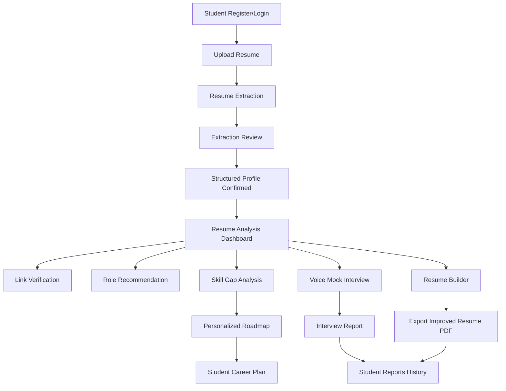
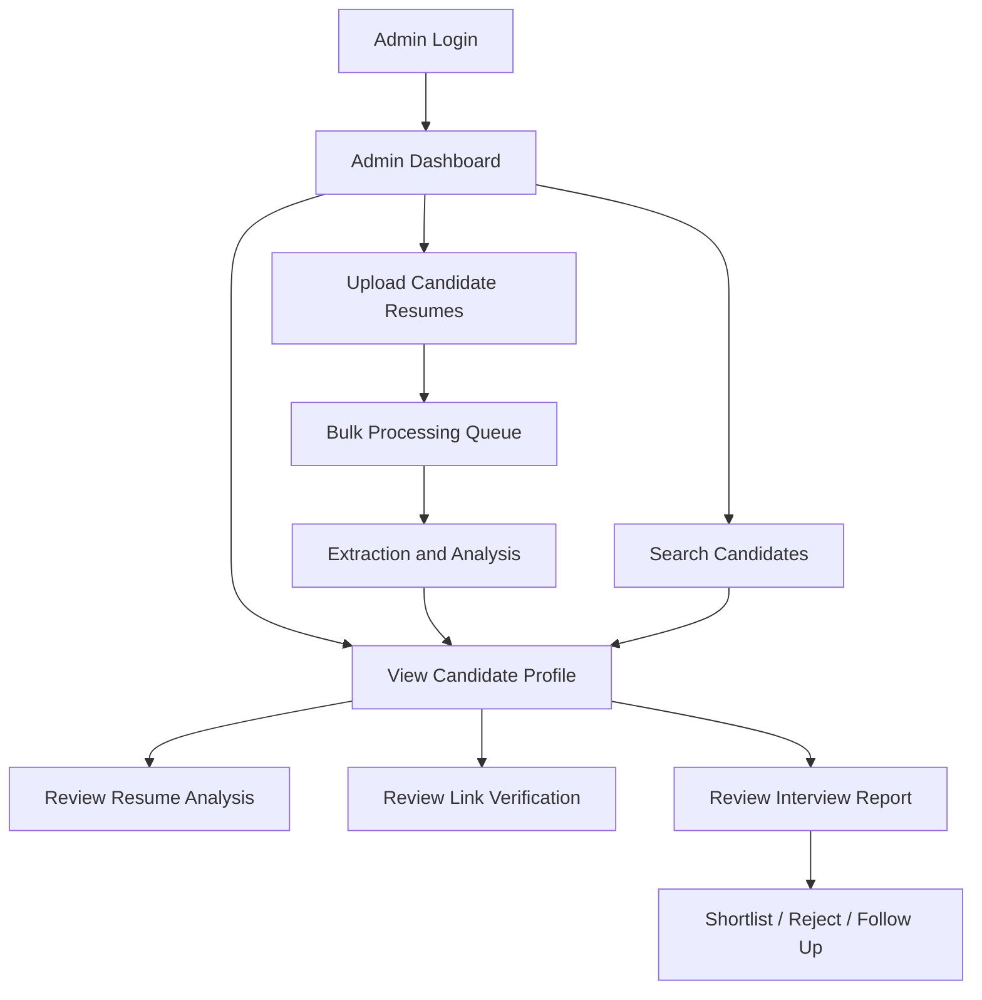
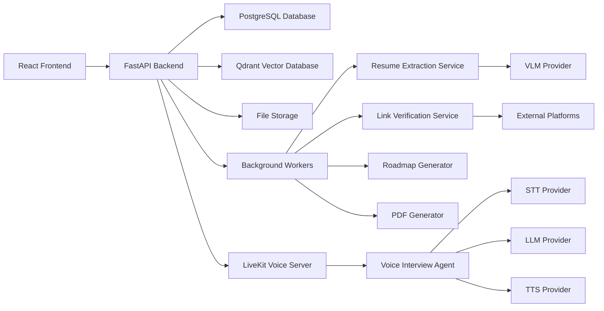
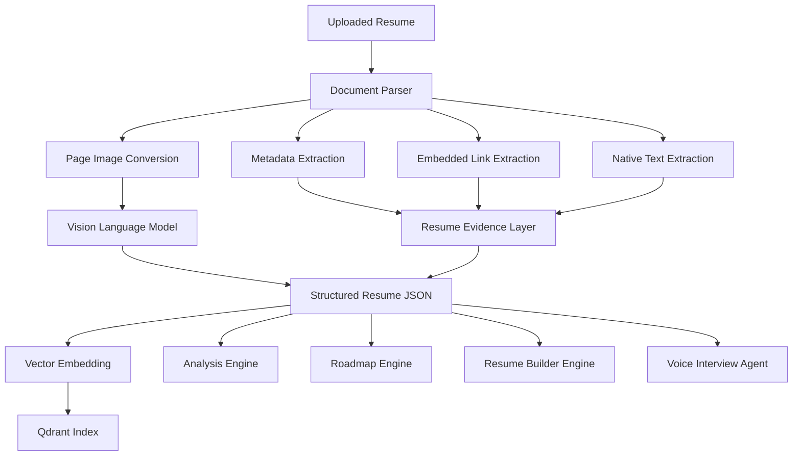

# RViewer AI Product Requirements Document

## 1. Product Vision

RViewer AI is an end-to-end AI Resume Intelligence Platform for students, job seekers, recruiters, and admins. The platform allows a student to upload a resume once and receive a complete career intelligence workflow: resume extraction, resume analysis, link verification, personalized roadmap, resume builder, and real-time voice-to-voice mock interview.

For admins and recruiters, the platform provides candidate management, bulk resume processing, candidate search, skill verification, interview report review, and hiring pipeline support.

The main goal is to convert a resume from a static document into a structured, verified, and actionable career profile.

## 2. Primary Users

### Student User

A student uses the platform to:

- Upload a resume.
- Extract structured profile data.
- Understand resume strengths and weaknesses.
- Check ATS readiness.
- Verify professional and coding links.
- Receive role recommendations.
- Get a personalized learning roadmap.
- Build an improved resume.
- Attend a voice-to-voice AI mock interview.
- Download reports and improved resume PDFs.

### Admin / Recruiter

An admin or recruiter uses the platform to:

- Upload single or bulk resumes.
- View candidate profiles.
- Search candidates using natural language.
- Review resume quality and role fit.
- Verify candidate links and claims.
- Review mock interview reports.
- Shortlist candidates.
- Monitor system usage and processing failures.

## 3. Product Scope

RViewer AI includes four major student-facing modules and one admin-facing workspace.

Student modules:

- Resume Extraction and Structured Profile
- Resume Analysis, Link Verification, and Role Recommendation
- Personalized Roadmap and Learning Plan
- Resume Builder and Voice-to-Voice Mock Interview

Admin modules:

- Candidate Management
- Bulk Resume Upload
- Natural Language Search
- Candidate Analysis Review
- Interview Report Review
- User and Role Management
- System Monitoring

## 4. Student Feature Set

### 4.1 Resume Upload

The student uploads a resume in PDF or DOCX format. The system validates the file, stores it, extracts metadata, detects embedded links, converts pages into images, and sends the resume content to AI extraction services.

Expected behavior:

- Accept PDF and DOCX files.
- Reject unsupported, corrupted, password-protected, or empty files.
- Show upload and processing status.
- Allow re-uploading a newer version.
- Maintain resume version history.

### 4.2 Resume Extraction

The extraction system converts the resume into structured JSON. It should understand layout, headings, skill groups, project sections, links, education, experience, certifications, achievements, and custom sections.

The extraction output becomes the foundation for every other module.

### 4.3 Extraction Review

After extraction, the student should see an editable structured profile before deeper analysis begins.

The review page should allow the student to correct:

- Name
- Email
- Phone
- Location
- Education
- Skills
- Projects
- Experience
- Certifications
- Links
- Target role

Low-confidence fields should be highlighted for review.

### 4.4 Resume Analysis Dashboard

The dashboard should show the student a complete resume health summary.

Dashboard insights:

- Overall resume score
- ATS score
- Section completeness
- Skill strength
- Skill gaps
- Project quality
- Role recommendations
- Link verification status
- Resume warnings
- Improvement priorities

### 4.5 Link Verification

The platform verifies links instead of only extracting them.

Supported link types:

- LinkedIn
- GitHub
- GitLab
- Bitbucket
- Portfolio
- LeetCode
- HackerRank
- HackerEarth
- Codeforces
- CodeChef
- Kaggle
- Stack Overflow
- Medium
- Dev.to
- Certification links
- Project demo links

Each link should have a verification status, confidence score, and evidence summary.

### 4.6 Personalized Roadmap

The roadmap is generated from the extracted profile, analysis result, and selected target role.

The roadmap should include:

- Tracks
- Skill nodes
- Dependencies
- Milestones
- Estimated durations
- Practice tasks
- Project suggestions
- Learning resources
- Mermaid mind-map view
- Timeline view

### 4.7 Resume Builder

The resume builder helps the student create an improved, role-targeted resume.

Builder capabilities:

- Template selection
- Section ordering
- AI bullet rewriting
- Role-specific keyword suggestions
- ATS-friendly formatting
- Project description improvement
- Summary generation
- Manual editing
- PDF export
- Resume version history

### 4.8 Voice-to-Voice AI Mock Interview

The student can attend a real-time spoken mock interview based on their resume.

Interview phases:

- Introduction
- Resume walkthrough
- Project deep dive
- Technical questions
- Problem-solving questions
- Behavioral questions
- Career goals
- Final feedback

The AI interviewer should ask resume-grounded questions and generate a scored interview report.

Report includes:

- Communication score
- Technical score
- Project understanding score
- Problem-solving score
- Confidence score
- Role readiness score
- Strengths
- Weaknesses
- Improvement suggestions
- Radar chart
- Downloadable PDF

## 5. Admin Feature Set

### 5.1 Admin Dashboard

The admin dashboard shows platform-level and candidate-level metrics.

Dashboard metrics:

- Total students
- Total resumes uploaded
- Total completed analyses
- Total completed interviews
- Average ATS score
- Average role readiness score
- Failed processing count
- Recent candidate activity

### 5.2 Candidate Management

Admins can view and manage all candidates.

Candidate table fields:

- Candidate name
- Email
- Target role
- Resume score
- ATS score
- Interview score
- Link verification status
- Last activity
- Status

### 5.3 Bulk Resume Upload

Admins can upload multiple resumes at once. Each resume should be processed asynchronously.

Bulk upload should show:

- Total files uploaded
- Processing count
- Successful extractions
- Failed extractions
- Duplicate resumes
- Error reason per failed file

### 5.4 Natural Language Candidate Search

Admins can search candidates using plain English.

Example queries:

- "Show students with React, FastAPI, and GitHub projects."
- "Find candidates with ATS score above 80."
- "Show ML candidates with Python, Kaggle, and strong project score."
- "Find full-stack candidates with interview score above 75."

The system should convert natural language into structured filters.

### 5.5 Candidate Profile Review

Admins can open a candidate profile and review:

- Extracted resume data
- ATS analysis
- Skills
- Projects
- Links
- Role recommendations
- Roadmap
- Resume builder versions
- Interview reports

### 5.6 Interview Report Review

Admins can inspect completed mock interviews.

Report view includes:

- Interview summary
- Transcript
- Score breakdown
- Radar chart
- Strengths
- Weaknesses
- Hiring notes
- Downloadable PDF

### 5.7 User and Role Management

Admins can manage:

- Student users
- Recruiter users
- Admin users
- Access permissions
- Account status

### 5.8 System Monitoring

Admins can monitor:

- Failed extractions
- Failed link checks
- Failed interviews
- AI provider errors
- Queue status
- API usage
- Storage usage
- Cost and latency trends

## 6. High-Level Product Flow

## 7. Admin Flow

## 8. High-Level Architecture

## 9. AI Architecture

## 10. Data Storage Requirements

The platform should store:

- Users
- Roles and permissions
- Resume files
- Resume metadata
- Extracted structured profile JSON
- Skills
- Projects
- Education
- Experience
- Links
- Link verification results
- ATS analysis results
- Role recommendations
- Roadmaps
- Resume builder versions
- Interview sessions
- Interview transcripts
- Interview reports
- Admin actions

PostgreSQL should be used for structured data. Qdrant should be used for embeddings and resume-grounded retrieval. File storage should be used for uploaded resumes, converted page images, generated reports, and exported resume PDFs.

## 11. Non-Functional Requirements

The platform must be:

- Secure
- Role-gated
- Async-first
- Scalable
- Provider-agnostic
- Resume-grounded
- Multi-user safe
- Resistant to hallucination
- Clear about confidence and uncertainty

Long-running tasks such as extraction, scraping, roadmap generation, and interview report generation should run in background workers.

## 12. Success Metrics

- Resume extraction accuracy above 90%.
- Normal resume analysis completion under 60 seconds.
- Link verification completion under 2 minutes.
- Resume PDF export success above 99%.
- Voice interview latency low enough for natural conversation.
- Admin candidate search results returned within seconds.
- Student receives useful analysis, roadmap, and next actions from one upload.
