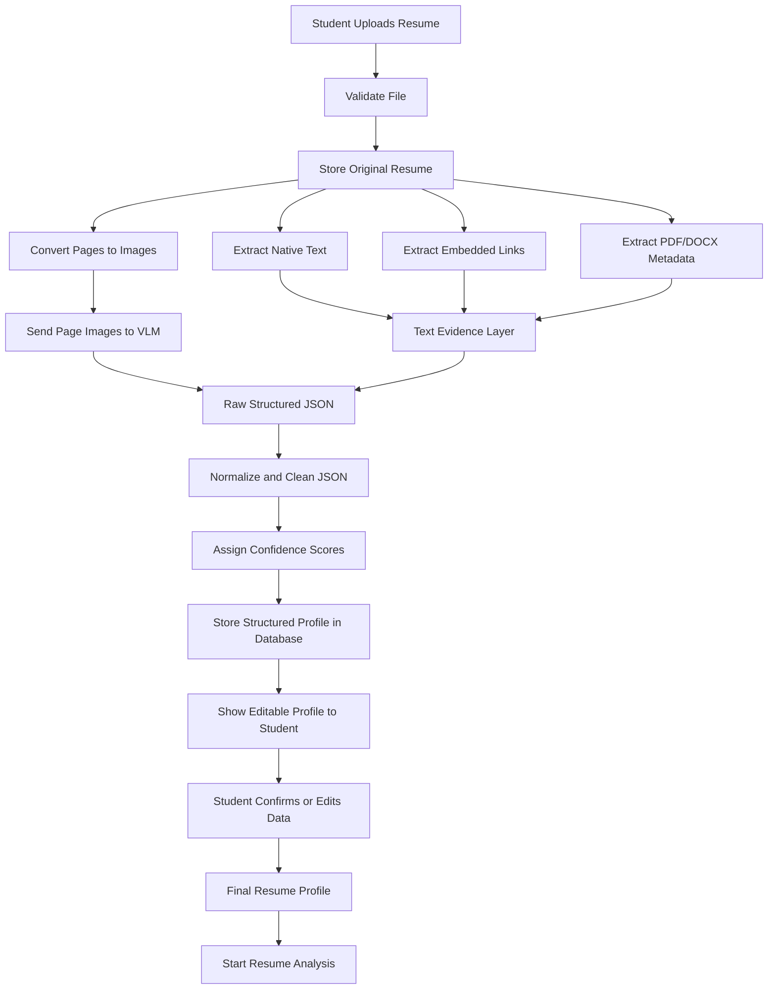
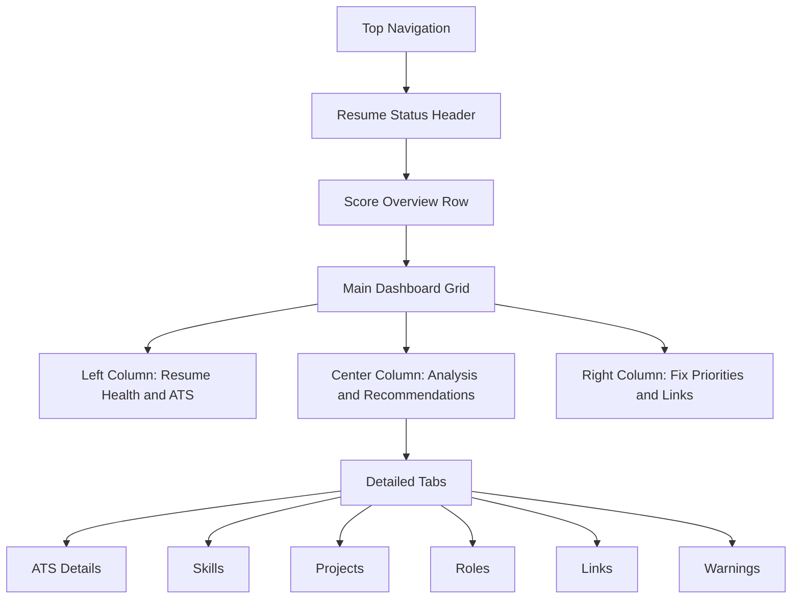
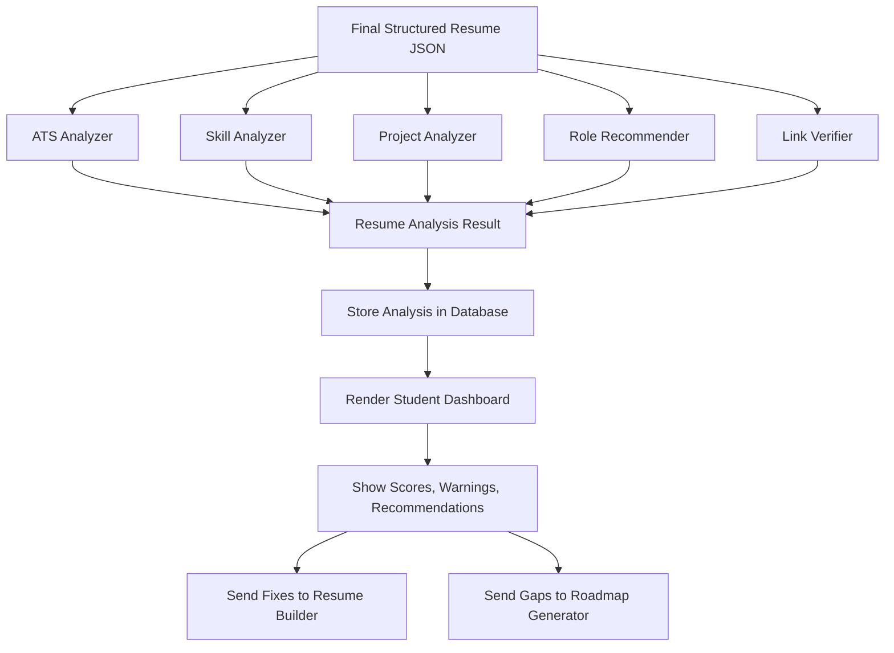
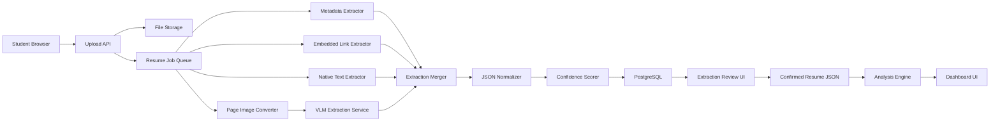

# Student Module: Resume Extraction and Resume Analysis

## 1. Module Goal

The Resume Extraction and Resume Analysis module is the foundation of the student experience in RViewer AI.

The goal is to let a student upload a resume and automatically convert it into a complete structured profile. After extraction, the system analyzes the resume for ATS quality, role fit, skill strength, project quality, missing information, link validity, and career readiness.

The student should not receive only raw parsed text. The student should receive a meaningful dashboard that explains:

- What is present in the resume.
- What is missing.
- How strong the resume is.
- Which roles match the profile.
- Which skills are strong.
- Which skills are weak.
- Which projects are valuable.
- Which links are verified.
- What should be improved first.

## 2. Resume Extraction Pipeline

### 2.1 Upload Stage

The student uploads a resume file.

Supported formats:

- PDF
- DOCX
- Future support: scanned images, LinkedIn exported PDF, image resumes

Upload validation:

- File type validation
- File size validation
- Page count validation
- Password-protected PDF detection
- Corrupted file detection
- Empty resume detection
- Duplicate resume detection using file hash

After successful upload, the file is stored in the upload storage layer and assigned a unique resume ID.

### 2.2 PDF / DOCX Metadata Extraction

Before deeper extraction, the system should extract all available embedded metadata from the file.

Metadata fields:

- File name
- File size
- File type
- Number of pages
- PDF title
- PDF author
- PDF creator
- PDF producer
- Created date
- Modified date
- Embedded fonts
- Selectable text availability
- Scanned or image-based document detection
- Embedded hyperlink availability
- Annotation availability
- Form field availability
- PDF language if available

Metadata helps the system understand whether it should rely more on native text extraction, OCR, or vision-based extraction.

### 2.3 Embedded Link Extraction

The system must extract hyperlinks embedded inside PDF or DOCX files.

Links may appear as:

- Visible text URLs
- Hidden hyperlink annotations
- Clickable icons
- Email links
- LinkedIn buttons
- GitHub icons
- Portfolio buttons
- Project demo links
- Certification verification links

Link types to detect:

- Email
- Phone links
- LinkedIn
- GitHub
- GitLab
- Bitbucket
- Portfolio website
- LeetCode
- HackerRank
- HackerEarth
- Codeforces
- CodeChef
- Kaggle
- Stack Overflow
- Medium
- Dev.to
- Behance
- Dribbble
- YouTube
- Google Drive
- ResearchGate
- ORCID
- Personal blog
- Project demo
- Certification verification
- Other custom links

Each extracted link should store:

- Original URL
- Normalized URL
- Link platform
- Link type
- Source page
- Anchor text if available
- Source type: embedded, visible text, inferred
- Verification status
- Confidence score

### 2.4 Page-to-Image Conversion

Each resume page should be converted into a high-resolution image.

Purpose:

- Preserve layout
- Understand visual hierarchy
- Detect columns
- Read icons
- Identify section boundaries
- Recover text missed by normal parsers
- Understand tables, badges, and design-heavy resumes

Recommended conversion:

- 200 to 300 DPI
- PNG format
- One image per page
- Preserve page order
- Store image dimensions

Example output:

```json
{
  "resume_id": "res_123",
  "pages": [
    {
      "page_number": 1,
      "image_path": "/pages/res_123_page_1.png",
      "width": 2480,
      "height": 3508
    }
  ]
}
```

### 2.5 Text Extraction Layer

In parallel with page image conversion, the system should extract machine-readable text.

Text extraction sources:

- Native PDF text
- DOCX text
- OCR text
- Table text
- Header text
- Footer text
- Hyperlink text

This text should be used as an evidence layer. It should support the VLM output but should not automatically become the final structured profile.

### 2.6 Vision Language Model Extraction

Each page image is sent to a Vision Language Model.

The VLM should identify:

- Resume sections
- Layout structure
- Headings
- Subheadings
- Contact information
- Skill groupings
- Project blocks
- Experience blocks
- Education blocks
- Certifications
- Achievements
- Links and icons
- Dates and durations
- Visual ordering
- Missing or unclear content

The VLM output should be structured JSON, not plain text.

The model should preserve original meaning and avoid inventing missing details. If a field is not present, the field should be empty or null. It should not hallucinate.

### 2.7 JSON Normalization

The raw VLM output must be cleaned and normalized.

Normalization includes:

- Standardizing date formats
- Removing duplicate skills
- Grouping similar skills
- Detecting invalid emails
- Detecting invalid phone numbers
- Normalizing URLs
- Separating project links from profile links
- Separating technical skills from soft skills
- Mapping skill names to canonical names
- Detecting unknown fields
- Assigning confidence scores

Examples:

- JS becomes JavaScript.
- Node becomes Node.js.
- Reactjs becomes React.
- Postgres becomes PostgreSQL.

### 2.8 Human-Editable Structured Profile

After extraction, the student should see the structured profile and be allowed to correct it.

Editable sections:

- Personal details
- Education
- Skills
- Projects
- Experience
- Internships
- Certifications
- Links
- Achievements
- Target role

Low-confidence fields should be visually marked.

Examples:

- Phone number confidence is low.
- Project duration not found.
- GitHub link detected but not verified.
- Education year unclear.

### 2.9 Database Storage

The final structured JSON is stored in the database.

Stored records:

- Resume file record
- Resume metadata
- Extracted profile JSON
- Extracted links
- Extracted skills
- Extracted projects
- Parsed sections
- Field confidence scores
- Resume version
- Analysis status
- Created timestamp
- Updated timestamp

The original uploaded file and converted page images should be stored separately in file storage.

## 3. Complete Resume JSON Structure

The resume JSON should support all fields and sectors, not only software engineering.

Supported candidate types:

- Engineering
- IT
- AI/ML
- Data
- Design
- Management
- Marketing
- Finance
- Healthcare
- Education
- Research
- Law
- Arts
- Media
- Sales
- Operations
- Government exam preparation
- Internships
- Freshers
- Experienced professionals

### 3.1 Root Structure

```json
{
  "resume_id": "",
  "user_id": "",
  "file_metadata": {},
  "personal_information": {},
  "career_objective": {},
  "professional_summary": {},
  "education": [],
  "work_experience": [],
  "internships": [],
  "projects": [],
  "skills": {},
  "certifications": [],
  "achievements": [],
  "publications": [],
  "research_experience": [],
  "volunteering": [],
  "leadership": [],
  "extracurriculars": [],
  "languages": [],
  "portfolio_links": [],
  "social_links": [],
  "coding_profiles": [],
  "design_profiles": [],
  "professional_profiles": [],
  "licenses": [],
  "awards": [],
  "patents": [],
  "courses": [],
  "workshops": [],
  "hackathons": [],
  "competitions": [],
  "references": [],
  "custom_sections": [],
  "extraction_confidence": {},
  "missing_fields": [],
  "warnings": []
}
```

### 3.2 Personal Information Fields

```json
{
  "full_name": "",
  "first_name": "",
  "last_name": "",
  "email": "",
  "phone": "",
  "alternate_phone": "",
  "location": "",
  "city": "",
  "state": "",
  "country": "",
  "postal_code": "",
  "nationality": "",
  "date_of_birth": "",
  "gender": "",
  "profile_photo_present": false,
  "headline": "",
  "current_role": "",
  "target_role": ""
}
```

Sensitive fields such as date of birth, gender, nationality, and photo should be optional and should not be required for scoring.

### 3.3 Education Fields

```json
{
  "institution_name": "",
  "degree": "",
  "field_of_study": "",
  "specialization": "",
  "start_date": "",
  "end_date": "",
  "currently_studying": false,
  "grade_type": "CGPA | GPA | Percentage | Marks | None",
  "grade_value": "",
  "location": "",
  "relevant_coursework": [],
  "honors": [],
  "activities": []
}
```

### 3.4 Work Experience Fields

```json
{
  "company_name": "",
  "role_title": "",
  "employment_type": "Full-time | Part-time | Internship | Freelance | Contract | Apprenticeship",
  "location": "",
  "start_date": "",
  "end_date": "",
  "currently_working": false,
  "duration": "",
  "responsibilities": [],
  "achievements": [],
  "tools_used": [],
  "skills_used": [],
  "impact_metrics": [],
  "domain": ""
}
```

### 3.5 Project Fields

```json
{
  "project_title": "",
  "description": "",
  "problem_statement": "",
  "solution": "",
  "role": "",
  "team_size": "",
  "start_date": "",
  "end_date": "",
  "tech_stack": [],
  "tools_used": [],
  "features": [],
  "impact": "",
  "metrics": [],
  "github_link": "",
  "demo_link": "",
  "documentation_link": "",
  "deployment_status": "",
  "complexity_level": "",
  "verified": false
}
```

### 3.6 Skills Fields

```json
{
  "technical_skills": [],
  "programming_languages": [],
  "frameworks": [],
  "libraries": [],
  "databases": [],
  "cloud_platforms": [],
  "devops_tools": [],
  "ai_ml_skills": [],
  "data_skills": [],
  "design_tools": [],
  "business_tools": [],
  "marketing_tools": [],
  "finance_tools": [],
  "healthcare_tools": [],
  "research_tools": [],
  "soft_skills": [],
  "domain_skills": [],
  "other_skills": []
}
```

### 3.7 Certification Fields

```json
{
  "certification_name": "",
  "issuing_organization": "",
  "issue_date": "",
  "expiry_date": "",
  "credential_id": "",
  "credential_url": "",
  "skills_covered": [],
  "verified": false
}
```

### 3.8 Link Fields

```json
{
  "url": "",
  "normalized_url": "",
  "platform": "",
  "link_type": "profile | project | certificate | publication | portfolio | social | other",
  "source": "embedded | visible_text | inferred",
  "page_number": 1,
  "anchor_text": "",
  "verification_status": "pending | verified | broken | private | unknown",
  "confidence_score": 0
}
```

## 4. Extraction Pipeline Flow Diagram



## 5. Resume Analysis Dashboard

### 5.1 Dashboard Goal

The dashboard should turn resume data into clear insights. It should feel like a career command center for the student.

The dashboard should answer:

- Is my resume good enough?
- What is my ATS score?
- What sections are missing?
- Which roles suit me?
- Which skills are strong?
- Which skills are weak?
- Are my links working?
- Are my projects impressive?
- What should I fix first?

## 6. Dashboard Components

### 6.1 Resume Health Score Card

Shows the overall resume quality.

Content:

- Overall score out of 100
- Status: Weak, Average, Good, Excellent
- Main improvement message
- Last analyzed date
- Resume version

Example:

"Your resume is 72/100. Strong project section, but missing measurable achievements and role-specific keywords."

### 6.2 ATS Score Card

Shows how well the resume may perform in Applicant Tracking Systems.

ATS checks:

- Contact information present
- Section headings clear
- Skills section present
- Education present
- Experience or projects present
- Keywords relevant to target role
- No unreadable formatting
- Bullet points are clear
- File format accepted
- No image-only text
- No excessive graphics
- Dates are consistent
- Resume length is appropriate

Output:

- ATS score
- Passed checks
- Failed checks
- Fix priority

### 6.3 Section Completeness Card

Shows which resume sections are complete or incomplete.

Sections:

- Personal info
- Summary or objective
- Education
- Skills
- Projects
- Experience
- Internships
- Certifications
- Achievements
- Links
- Publications
- Volunteering

Each section should show:

- Complete
- Partial
- Missing
- Low confidence

### 6.4 Skill Intelligence Panel

Shows the student's skills grouped by category.

Skill categories:

- Programming languages
- Frameworks
- Databases
- Cloud
- DevOps
- AI/ML
- Data analytics
- Design
- Business
- Soft skills
- Domain skills

Each skill can show:

- Detected from resume
- Verified from project or link
- Strong evidence
- Weak evidence
- Missing for target role

### 6.5 Role Recommendation Panel

Suggests best-fit roles.

For each role:

- Role name
- Fit percentage
- Matching skills
- Missing skills
- Suggested next steps
- Recommended roadmap link

Example roles:

- Frontend Developer
- Backend Developer
- Full Stack Developer
- Data Analyst
- Data Scientist
- ML Engineer
- DevOps Engineer
- UI/UX Designer
- Product Analyst
- Business Analyst
- Digital Marketer
- Finance Analyst

### 6.6 Skill Gap Analysis

Compares the current profile against the selected target role.

Output:

- Required skills
- Skills already present
- Missing skills
- Weak skills
- Priority skills
- Estimated learning time
- Roadmap connection

### 6.7 Project Analysis Panel

Analyzes each project in the resume.

Each project card should show:

- Project title
- Tech stack
- Complexity score
- Originality score
- Business value
- Deployment status
- GitHub or demo availability
- Weak description warning
- Improvement suggestion

Project scoring dimensions:

- Technical depth
- Problem clarity
- Feature completeness
- Real-world usefulness
- Code availability
- Deployment
- Measurable impact
- Relevance to target role

### 6.8 Bullet Quality Analyzer

Detects weak resume bullets.

Checks:

- Too generic
- No action verb
- No metric
- No outcome
- Too long
- Too short
- Repetitive
- Passive wording
- Missing tools or technologies

Example weak bullet:

"Worked on machine learning model."

Example improved bullet:

"Built a machine learning classification model using Python and Scikit-learn, improving prediction accuracy by 18% on cleaned customer data."

### 6.9 Link Verification Panel

Shows whether resume links are valid and useful.

For each link:

- Platform
- URL
- Status
- Last checked
- Confidence
- Public activity
- Resume claim match
- Warning if broken or private

Statuses:

- Verified
- Broken
- Private
- Mismatch
- Not reachable
- Needs review

### 6.10 Resume Warnings Panel

Shows critical issues.

Warnings:

- Missing email
- Missing phone
- Broken LinkedIn
- Broken GitHub
- No measurable achievements
- No project links
- No role keywords
- Too many buzzwords
- Unclear dates
- Inconsistent formatting
- Resume too long
- Resume too short
- Low extraction confidence

### 6.11 Improvement Priority List

Shows what the student should fix first.

Priority levels:

- Critical
- High
- Medium
- Low

Example priorities:

1. Add measurable outcomes to project bullets.
2. Add GitHub or demo links for top projects.
3. Add target-role keywords.
4. Rewrite career summary.
5. Fix broken LinkedIn URL.

### 6.12 Resume Timeline

Displays the candidate journey visually.

Timeline items:

- Education
- Internships
- Work experience
- Projects
- Certifications
- Achievements

This helps identify gaps or inconsistencies.

### 6.13 AI Summary Card

Shows a short plain-English explanation of the student's current profile.

Example:

"You are strongest for entry-level frontend and full-stack roles. Your React and JavaScript skills are visible, but your backend and deployment experience need stronger evidence. Add live project links and measurable outcomes to improve your score."

## 7. Suggested Dashboard UI Structure

### 7.1 Page Layout



### 7.2 Header Area

The top area should show:

- Resume name
- Upload date
- Current target role
- Analysis status
- Re-analyze button
- Download report button
- Go to Resume Builder button

### 7.3 Score Overview Row

Four main cards:

- Resume Health Score
- ATS Score
- Role Fit Score
- Link Verification Score

Each card should have:

- Score
- Color status
- One-line explanation
- Click to view details

### 7.4 Main Dashboard Body

Left side:

- ATS score breakdown
- Section completeness
- Resume warnings

Center:

- AI summary
- Role recommendations
- Skill gap analysis
- Project analysis

Right side:

- Fix priority list
- Verified links
- Resume builder suggestions

### 7.5 Detailed Tabs

Tabs should include:

- Overview
- ATS Analysis
- Skills
- Projects
- Role Match
- Link Verification
- Improvements

Each tab should provide deeper information without crowding the main dashboard.

## 8. Resume Analysis Flow Diagram



## 9. Resume Analysis Output JSON

```json
{
  "resume_id": "",
  "overall_score": 0,
  "ats_score": 0,
  "role_fit_score": 0,
  "link_verification_score": 0,
  "section_completeness": {},
  "skills": {
    "strong_skills": [],
    "weak_skills": [],
    "missing_skills": [],
    "verified_skills": []
  },
  "role_recommendations": [],
  "project_analysis": [],
  "bullet_analysis": [],
  "link_analysis": [],
  "warnings": [],
  "improvement_priorities": [],
  "ai_summary": "",
  "next_actions": []
}
```

## 10. Student Navigation for This Module

Recommended student-side pages:

- Upload Resume
- Extraction Processing
- Extraction Review
- Dashboard Overview
- ATS Analysis
- Skills Analysis
- Project Analysis
- Role Recommendations
- Link Verification
- Improvement Plan

Resume Builder, Roadmap, and Voice Interview should all use the same confirmed structured resume JSON.

## 11. Module Architecture



## 12. Important Product Rule

The platform should not directly trust AI extraction.

The correct flow is:

1. Upload resume.
2. Extract metadata, links, text, and page images.
3. Use VLM for layout-aware extraction.
4. Normalize output into structured JSON.
5. Show extraction review page.
6. Let the student confirm or edit.
7. Run analysis using confirmed resume JSON.
8. Use the same confirmed JSON for dashboard, roadmap, builder, and interview.
