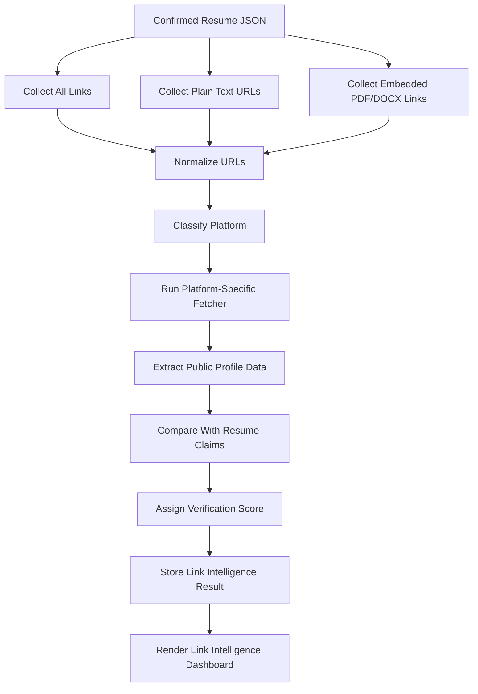
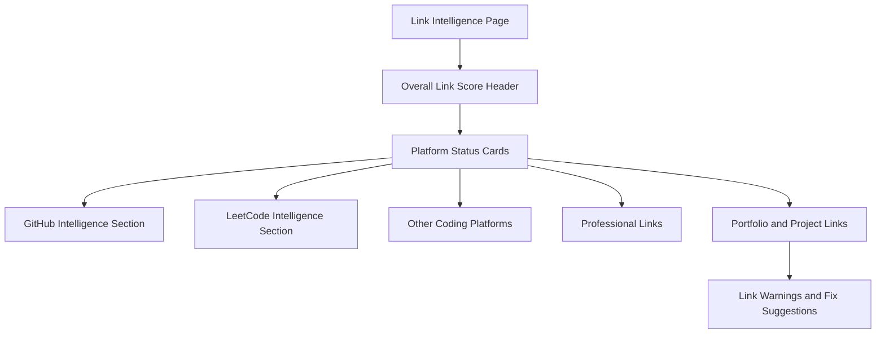
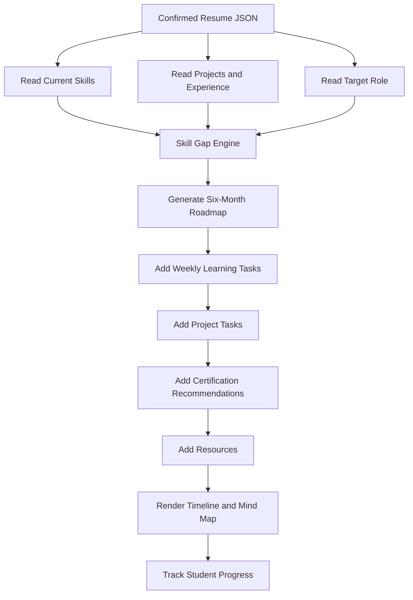
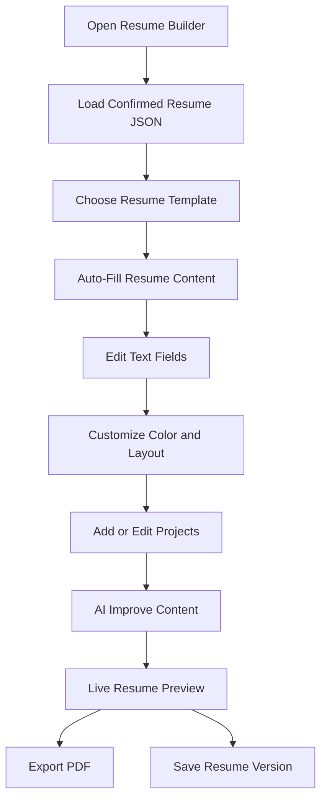
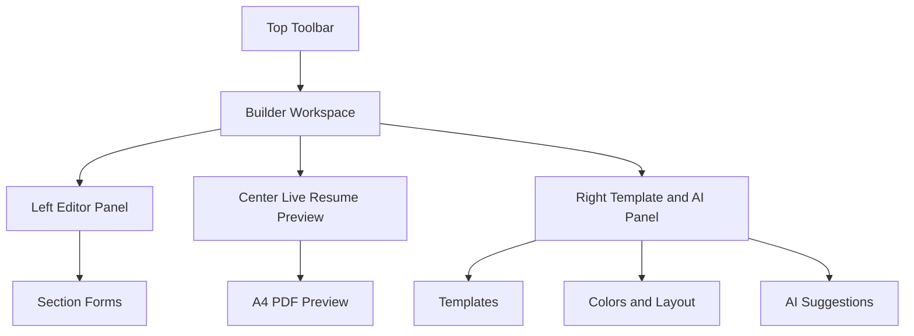
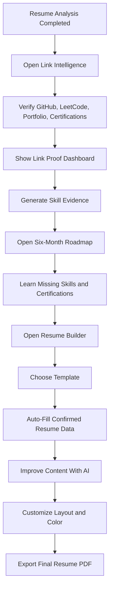
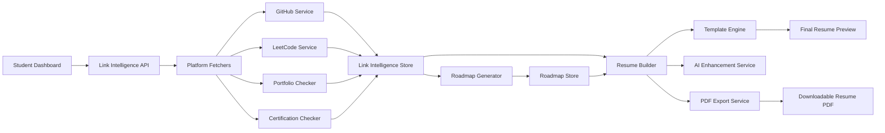

# Student Module: Link Intelligence, Roadmap, and Resume Builder

## 1. Module Goal

This module continues the student journey after resume extraction and resume analysis.

The goal is to use the confirmed resume JSON and extracted links to create three major student experiences:

- Link Intelligence Dashboard
- Six-Month Personalized Roadmap
- Modern AI Resume Builder

These features should help the student prove their skills, understand what to learn next, and create a stronger resume from the same verified profile data.

## 2. Required Input From Previous Module

This module depends on the confirmed structured resume profile.

Required inputs:

- Confirmed resume JSON
- Extracted profile links
- Extracted project links
- Extracted certification links
- Extracted skills
- Extracted projects
- Target role
- Resume analysis result
- Skill gap analysis result
- Role recommendation result

Important rule:

The platform should not ask the student to manually re-enter information that already exists in the confirmed resume JSON. Existing data should be auto-filled everywhere and remain editable.

## 3. Feature 1: Link Intelligence Dashboard

### 3.1 Purpose

The Link Intelligence Dashboard verifies and displays the student's external proof of work.

The system should not only check whether a link is working. It should extract useful public profile information and show whether the external profile supports the claims made in the resume.

Examples:

- If the resume says "GitHub projects", GitHub activity should be shown.
- If the resume says "solved 300 problems", LeetCode stats should be checked.
- If the resume has a portfolio link, it should be checked for availability and quality.
- If a certification link exists, it should be verified where possible.

## 4. Link Extraction and Verification Pipeline



## 5. Supported Link Platforms

The system should support the following categories.

### 5.1 Coding and Developer Platforms

- GitHub
- GitLab
- Bitbucket
- LeetCode
- HackerRank
- HackerEarth
- Codeforces
- CodeChef
- Kaggle
- Stack Overflow

### 5.2 Professional Platforms

- LinkedIn
- Personal portfolio
- Medium
- Dev.to
- Hashnode
- ResearchGate
- ORCID
- Google Scholar

### 5.3 Creative and Design Platforms

- Behance
- Dribbble
- Figma community links
- Canva portfolio links

### 5.4 Project and Proof Links

- Live demo links
- Vercel
- Netlify
- Render
- Railway
- GitHub Pages
- Google Drive
- YouTube demo
- Certification verification links

## 6. GitHub Link Intelligence

### 6.1 GitHub Dashboard Goal

The GitHub section should visually reflect the student's public GitHub activity. It should feel familiar to the GitHub profile page, especially the contribution heatmap.

The GitHub contribution heatmap should be displayed as close as possible to the original GitHub style:

- Calendar grid
- Day-wise contribution boxes
- Month labels
- Week alignment
- Light-to-dark activity intensity
- Tooltip on hover
- Contribution count per day

### 6.2 GitHub Metrics To Display

The GitHub card should include:

- Username
- Profile avatar
- Profile URL
- Bio
- Public repositories count
- Followers count
- Following count
- Total stars received
- Total forks received
- Total commits if available
- Total pull requests if available
- Total issues if available
- Total contributions
- Contribution streak
- Longest contribution streak
- Current contribution streak
- Most used languages
- Top repositories
- Recently active repositories
- Pinned repositories if available
- Repository freshness
- README quality signal
- License availability signal

### 6.3 GitHub Repository Metrics

Each repository card should show:

- Repository name
- Description
- Primary language
- Stars
- Forks
- Watchers
- Open issues
- Last updated date
- Created date
- Repository size
- Topics
- Has README
- Has license
- Has deployment link
- Resume project match confidence

### 6.4 GitHub Resume Claim Matching

The system should compare resume projects with GitHub repositories.

Matching signals:

- Project name similarity
- Tech stack similarity
- Description similarity
- Link match
- Repository activity
- Last updated date
- Presence of code
- Presence of deployment URL

Output statuses:

- Matched
- Partially matched
- Not found
- Private or unavailable
- Needs student review

### 6.5 GitHub UI Components

GitHub section components:

- GitHub profile summary card
- GitHub contribution heatmap
- Activity streak card
- Repository count card
- Stars and forks card
- Followers card
- Language distribution chart
- Top repositories table
- Resume project match panel
- GitHub warnings panel

GitHub warnings:

- GitHub link is broken.
- GitHub profile has no public repositories.
- Resume project not found on GitHub.
- Project repository has no README.
- Repository has not been updated recently.
- Repository has no deployment link.

## 7. LeetCode Link Intelligence

### 7.1 LeetCode Dashboard Goal

The LeetCode section should show the student's coding practice strength, problem-solving areas, language usage, difficulty distribution, and concept coverage.

The most important visual should be a radar chart showing concept strength.

### 7.2 LeetCode Metrics To Display

The LeetCode card should include:

- Username
- Profile URL
- Total solved count
- Easy solved count
- Medium solved count
- Hard solved count
- Acceptance rate
- Ranking if available
- Reputation if available
- Contest rating if available
- Badges if available
- Active days if available
- Recent submissions if available
- Language-wise submission count
- Topic-wise solved count
- Algorithm concept coverage

### 7.3 LeetCode Concept Radar Graph

The radar graph should show strengths across problem-solving concepts.

Radar graph concepts:

- Arrays
- Strings
- Hashing
- Two pointers
- Sliding window
- Stack
- Queue
- Linked list
- Binary tree
- Binary search tree
- Graphs
- Dynamic programming
- Greedy
- Backtracking
- Recursion
- Sorting
- Searching
- Heap / priority queue
- Trie
- Bit manipulation
- Math
- Database / SQL

Each concept should have a score from 0 to 100 based on solved problems and difficulty mix.

Example:

```json
{
  "arrays": 82,
  "strings": 75,
  "graphs": 40,
  "dynamic_programming": 35,
  "greedy": 68
}
```

### 7.4 LeetCode Difficulty Display

The dashboard should show:

- Easy solved
- Medium solved
- Hard solved
- Total solved
- Unsolved priority topics

Visual components:

- Difficulty donut chart
- Problem count cards
- Topic radar chart
- Language usage bar chart
- Recent activity list

### 7.5 Language Count

The LeetCode section should show programming languages used by the student.

Example:

- C++: 120 submissions
- Python: 80 submissions
- Java: 40 submissions
- JavaScript: 10 submissions

This helps identify the student's strongest coding language.

### 7.6 LeetCode Resume Claim Matching

The system should compare resume claims with LeetCode data.

Examples:

- Resume says "Solved 500+ problems", LeetCode shows 240 solved.
- Resume says "Strong in dynamic programming", radar score shows weak DP coverage.
- Resume says "C++ problem solving", LeetCode language usage confirms C++.

Output:

- Claim verified
- Claim partially verified
- Claim mismatch
- Not enough public data

## 8. Link Intelligence Dashboard UI Structure

### 8.1 Page Layout



### 8.2 Header

Header content:

- Overall link verification score
- Number of links found
- Number of verified links
- Number of broken links
- Number of links needing review
- Last checked date
- Re-check links button

### 8.3 Platform Cards

Each platform card should show:

- Platform icon
- Link status
- Verification score
- Main metric
- Last checked date
- View details button

Examples:

- GitHub: Verified, 28 repos, 1,240 contributions
- LeetCode: Verified, 312 problems solved
- LinkedIn: Verified, profile reachable
- Portfolio: Warning, SSL issue detected

### 8.4 Detailed Link Sections

Tabs:

- Overview
- GitHub
- LeetCode
- Coding Platforms
- Portfolio
- Certifications
- Warnings

## 9. Link Intelligence Output JSON

```json
{
  "resume_id": "",
  "overall_link_score": 0,
  "links_found": 0,
  "verified_links": 0,
  "broken_links": 0,
  "needs_review": 0,
  "platforms": {
    "github": {
      "status": "",
      "username": "",
      "profile_url": "",
      "public_repos": 0,
      "followers": 0,
      "following": 0,
      "total_stars": 0,
      "total_forks": 0,
      "total_contributions": 0,
      "current_streak": 0,
      "longest_streak": 0,
      "contribution_heatmap": [],
      "languages": [],
      "top_repositories": [],
      "resume_project_matches": []
    },
    "leetcode": {
      "status": "",
      "username": "",
      "profile_url": "",
      "total_solved": 0,
      "easy_solved": 0,
      "medium_solved": 0,
      "hard_solved": 0,
      "acceptance_rate": 0,
      "ranking": null,
      "language_counts": [],
      "concept_radar": {},
      "recent_activity": [],
      "resume_claim_matches": []
    }
  },
  "warnings": [],
  "recommendations": []
}
```

## 10. Feature 2: Six-Month Personalized Roadmap

### 10.1 Purpose

The roadmap feature generates a six-month learning plan based on the student's resume, target role, current skills, skill gaps, project quality, and verified link data.

The roadmap should not be generic. It should tell the student exactly what to learn next to become stronger for the target role.

### 10.2 Roadmap Inputs

Roadmap generation should use:

- Confirmed resume JSON
- Target role
- Current skill list
- Strong skills
- Weak skills
- Missing skills
- Project analysis
- Link intelligence
- ATS analysis
- Student level: fresher, intern, junior, intermediate
- Available weekly learning time if provided

### 10.3 Roadmap Duration

Default duration:

- 6 months

Roadmap breakdown:

- Month 1: Foundations and missing basics
- Month 2: Core role skills
- Month 3: Applied practice
- Month 4: Project building
- Month 5: Advanced topics and certification preparation
- Month 6: Portfolio polish, interview preparation, and resume update

### 10.4 Roadmap Output

Each roadmap should contain:

- Monthly plan
- Weekly tasks
- Skill goals
- Learning resources
- Practice exercises
- Project tasks
- Certification recommendations
- Portfolio improvement tasks
- Resume improvement tasks
- Mock interview preparation tasks

### 10.5 Certification Recommendations

The roadmap should recommend certifications based on the student's target role.

Examples:

Frontend:

- Meta Front-End Developer Professional Certificate
- JavaScript Algorithms and Data Structures
- React certification-style courses

Backend:

- AWS Cloud Practitioner
- MongoDB Developer Certification
- Postman API Fundamentals

Data:

- Google Data Analytics Professional Certificate
- Microsoft Power BI Data Analyst
- Tableau Desktop Specialist

AI/ML:

- Machine Learning Specialization
- TensorFlow Developer Certificate-style path
- AWS Machine Learning Specialty preparation

Cloud / DevOps:

- AWS Cloud Practitioner
- Azure Fundamentals
- Docker and Kubernetes certification-style path

### 10.6 Roadmap Visualizations

Roadmap views:

- Month-wise timeline
- Week-wise checklist
- Skill dependency graph
- Mermaid mind-map
- Progress tracker
- Certification tracker

### 10.7 Roadmap Flow



### 10.8 Roadmap JSON

```json
{
  "resume_id": "",
  "target_role": "",
  "duration_months": 6,
  "current_level": "",
  "roadmap_summary": "",
  "months": [
    {
      "month": 1,
      "title": "",
      "goal": "",
      "weeks": [
        {
          "week": 1,
          "focus": "",
          "tasks": [],
          "resources": [],
          "practice": [],
          "deliverables": []
        }
      ],
      "skills_covered": [],
      "project_work": [],
      "certification_recommendations": []
    }
  ],
  "skill_dependencies": [],
  "certifications": [],
  "progress": {}
}
```

## 11. Feature 3: Modern AI Resume Builder

### 11.1 Purpose

The Resume Builder is the main resume creation experience. It allows the student to use extracted resume data, fill missing fields, select templates, customize design, improve text with AI, and export a polished PDF.

The builder should feel modern, professional, fast, and highly visual.

### 11.2 Resume Builder Input Sources

The builder should collect data from:

- Confirmed resume JSON
- Student manual text fields
- Resume analysis suggestions
- AI-enhanced bullet generation
- Template-specific fields
- Project creator input
- Gemini-powered template/content suggestions if configured

### 11.3 Resume Builder Core Flow



### 11.4 Template System

The builder should support multiple resume templates.

Template categories:

- ATS-friendly template
- Modern professional template
- Fresher template
- Internship template
- Software developer template
- Data analyst template
- Designer template
- Business/management template
- Academic/research template
- Minimal one-page template

Each template should define:

- Sections supported
- Section order
- Typography
- Spacing
- Color tokens
- Layout style
- Header style
- Sidebar availability
- Page size
- PDF export rules

### 11.5 Template Interaction Behavior

When the user selects or touches a template:

- Existing resume data should immediately shift into that template.
- The live preview should update instantly.
- Content should not be lost.
- Unsupported fields should move into optional/custom sections.
- The user should be able to switch templates without re-entering data.

Important rule:

Template change should affect layout and styling, not destroy user content.

### 11.6 Resume Builder Text Fields

Editable fields:

- Full name
- Headline
- Email
- Phone
- Location
- Links
- Summary
- Education
- Skills
- Projects
- Experience
- Internships
- Certifications
- Achievements
- Publications
- Languages
- Custom sections

Each section should allow:

- Add item
- Edit item
- Delete item
- Reorder item
- Hide/show section
- AI improve text

### 11.7 Project Creator Input

The resume builder should include a project creator form.

Project creator fields:

- Project title
- Problem statement
- Solution
- Role in project
- Team size
- Tech stack
- Main features
- Challenges solved
- Impact
- Metrics
- GitHub link
- Demo link
- Documentation link
- Start date
- End date

AI should convert project inputs into strong resume bullets.

Example input:

- Project: AI Resume Analyzer
- Stack: React, FastAPI, PostgreSQL
- Work: uploaded resume and got analysis

AI output:

- Built an AI-powered resume analysis platform using React, FastAPI, and PostgreSQL to extract candidate data, generate ATS insights, and display role-specific improvement recommendations.

### 11.8 AI Content Enhancement

AI should improve:

- Summary
- Project descriptions
- Work experience bullets
- Internship bullets
- Achievement bullets
- Skills grouping
- Role-specific keywords

Enhancement options:

- Make more professional
- Make ATS-friendly
- Add impact
- Make concise
- Make fresher-friendly
- Make role-specific
- Improve grammar
- Convert paragraph to bullet points

### 11.9 Gemini Template and Content Support

If Gemini API key is configured, the builder can use Gemini for:

- Template-aware content placement
- Resume section restructuring
- AI bullet enhancement
- Role-specific summary generation
- Project wording improvement
- Design-aware section fitting
- Missing section suggestions

Gemini should not overwrite user content without confirmation.

Expected behavior:

- User clicks AI Improve.
- System shows improved version.
- User can accept, reject, or edit.
- Accepted text updates the resume preview.

### 11.10 Color and Layout Customization

The builder should allow visual customization.

Controls:

- Color swatches
- Font family selector
- Font size control
- Section spacing control
- Header style selector
- One-column / two-column layout toggle
- Section order drag-and-drop
- Page margin control
- Icon visibility toggle
- Link visibility toggle

Color options:

- Professional blue
- Charcoal
- Emerald
- Burgundy
- Slate
- Black and white
- Custom accent color

### 11.11 Live Preview

The resume preview should update in real time.

Preview requirements:

- Show exact PDF layout.
- Support A4 preview.
- Show page boundaries.
- Warn when content overflows.
- Support zoom in/out.
- Support page navigation.
- Support mobile-friendly preview mode.

### 11.12 PDF Export

The builder should export a polished PDF.

PDF requirements:

- A4 format
- ATS-readable text
- Selectable text
- Clickable links
- Clean spacing
- No broken layout
- No hidden overflow
- Proper section order
- Downloadable file

Export options:

- Download PDF
- Save version
- Duplicate version
- Export plain ATS version
- Export designed version

## 12. Resume Builder UI Standard

### 12.1 Overall UI Direction

The resume builder should look like a modern professional editor, not a basic form.

The experience should feel similar to a focused design tool:

- Left panel for editing
- Center area for live resume preview
- Right panel for AI suggestions and template controls
- Top toolbar for actions
- Bottom or side status for save/export state

### 12.2 Builder Layout



### 12.3 Top Toolbar

Toolbar items:

- Back to dashboard
- Resume version name
- Save status
- Undo
- Redo
- Preview mode
- Download PDF
- Save version
- Template selector

### 12.4 Left Editor Panel

The left panel contains editable resume sections.

Recommended sections:

- Basics
- Summary
- Education
- Skills
- Projects
- Experience
- Certifications
- Achievements
- Links
- Custom sections

Each section should be collapsible.

### 12.5 Center Preview

The center area shows the resume exactly as it will export.

Preview controls:

- Zoom in
- Zoom out
- Fit to screen
- Page selector
- Overflow warning
- Print-safe preview

### 12.6 Right Panel

The right panel contains design and AI tools.

Tabs:

- Templates
- Style
- AI Improve
- Checks

Template tab:

- Template gallery
- Template preview thumbnails
- Current template indicator

Style tab:

- Color swatches
- Font selector
- Spacing controls
- Layout toggle
- Header style

AI Improve tab:

- Improve summary
- Improve selected bullet
- Improve all weak bullets
- Add metrics
- Make role-specific
- Make concise

Checks tab:

- ATS warnings
- Overflow warnings
- Missing fields
- Broken links
- Weak bullet warnings

## 13. Resume Builder State Model

```json
{
  "builder_id": "",
  "resume_id": "",
  "template_id": "",
  "version_name": "",
  "content": {},
  "style": {
    "accent_color": "",
    "font_family": "",
    "font_size": "",
    "spacing": "",
    "layout": "one_column | two_column",
    "header_style": ""
  },
  "hidden_sections": [],
  "section_order": [],
  "ai_suggestions": [],
  "export_history": [],
  "updated_at": ""
}
```

## 14. Combined Student Flow



## 15. Module Architecture



## 16. Important Product Rules

1. Link extraction and link intelligence should use both embedded document links and visible resume text links.
2. GitHub contribution heatmap should visually match GitHub's familiar contribution grid as closely as possible.
3. LeetCode should show concept-level strength through a radar graph.
4. The six-month roadmap must be based on the student's actual resume and target role, not a generic course list.
5. Certification recommendations must match the target role and current skill gaps.
6. Resume builder templates must never delete user content when switching templates.
7. AI improvements must be previewed before replacing existing text.
8. PDF export must produce selectable, ATS-readable text with clickable links.
9. Resume Builder should feel like a polished modern editor with live preview, template control, style control, and AI suggestions.
