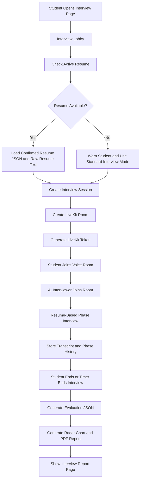
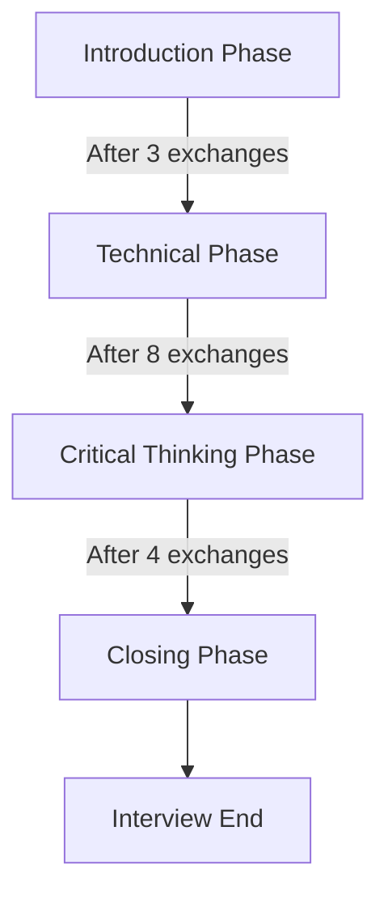
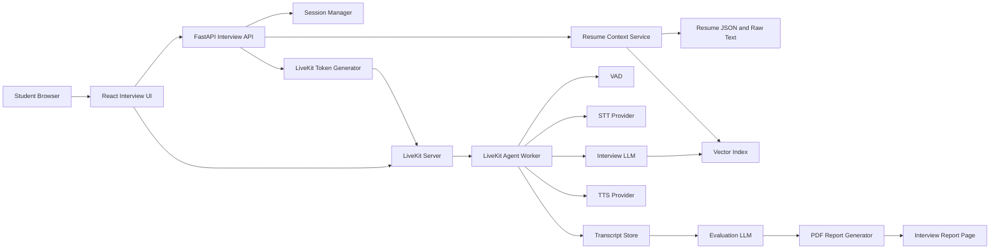
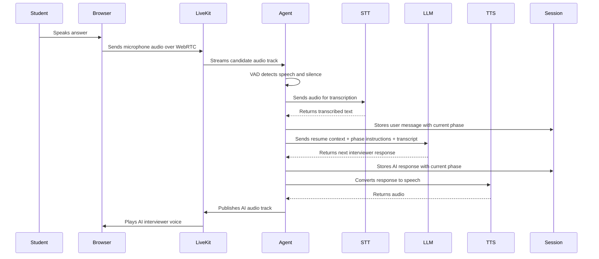
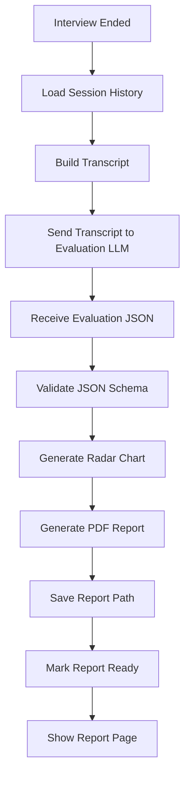
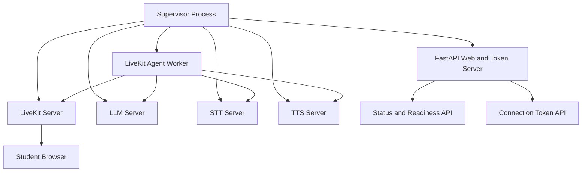

# Student Module: Voice-to-Voice Resume-Based AI Interview

## 1. Module Goal

The Voice-to-Voice Interview module gives the student a real-time spoken mock interview based on their own resume.

The interview should not be a generic chatbot conversation. It must use the confirmed resume JSON, extracted resume text, projects, skills, role recommendation, and target role to ask phase-wise questions that feel like a real technical or career interview.

The student speaks naturally through the microphone. The AI interviewer listens, transcribes the answer, reasons over the resume context, replies by voice, stores the conversation transcript, and generates a scored interview report at the end.

## 2. Source Context Used For This Module

This module is designed from two inputs:

- The attached `local-voice-ai` backend architecture report.
- The current RViewer AI interview files:
  - `server/app/core/interview/agent.py`
  - `server/app/core/interview/flow_manager.py`
  - `server/app/core/interview/resume_service.py`
  - `server/app/core/interview/llm_service.py`
  - `server/app/core/interview/report_generator.py`
  - `server/app/core/interview/session_manager.py`
  - `server/app/core/interview/prompts/interview.md`
  - `server/app/core/interview/prompts/report.md`
  - `server/app/api/v1/interview.py`
  - `client/src/pages/interview/InterviewLobbyPage.tsx`
  - `client/src/pages/interview/InterviewRoomInner.tsx`

The attached `local-voice-ai` report describes a single supervised runtime that can manage LiveKit, local LLM, local STT, local TTS, a LiveKit agent worker, token generation, readiness status, and first-boot progress. RViewer AI can use the same architectural idea, but the product behavior must be resume-grounded and interview-specific.

## 3. Student Interview Flow



## 4. Resume-Grounded Interview Behavior

The interview must be grounded in the student's resume.

The AI should use:

- Candidate name
- Target role
- Professional summary
- Education
- Skills
- Projects
- Work experience
- Internships
- Certifications
- Achievements
- GitHub and coding profile evidence
- Resume analysis warnings
- Skill gaps
- Role recommendation result

The AI interviewer should ask questions that are directly connected to what the student claims.

Examples:

- If the resume contains React, ask about components, state, hooks, routing, API integration, and performance.
- If the resume contains FastAPI, ask about routing, validation, authentication, async behavior, and database integration.
- If the resume contains machine learning, ask about dataset preparation, model choice, metrics, overfitting, and deployment.
- If the resume contains GitHub projects, ask how the project was structured, tested, deployed, and improved.
- If the resume contains leadership or teamwork, ask about collaboration, conflict, planning, and decision-making.

Important rule:

The AI should not invent projects, companies, skills, or experiences that are not found in the resume context. If a detail is missing, the AI can ask the student to explain it.

## 5. Interview Phase Design

The existing interview flow contains four phases:

- Introduction
- Technical
- Critical
- Closing

For the final product, this should be expanded into a richer resume-based flow while still keeping the current implementation compatible.

## 6. Recommended Final Interview Phases

### 6.1 Phase 1: Introduction

Goal:

- Welcome the student.
- Confirm the session is ready.
- Ask the student to introduce themselves.
- Let the student choose or confirm their target role.

Question examples:

- "Welcome. I have reviewed your resume. Could you briefly introduce yourself and tell me what role you are preparing for?"
- "Which project from your resume are you most confident discussing today?"

Expected scoring:

- Clarity
- Confidence
- Role awareness
- Communication

### 6.2 Phase 2: Resume Walkthrough

Goal:

- Understand the student's background.
- Ask about education, internships, projects, and skills.
- Validate whether the student can explain their own resume clearly.

Question examples:

- "Walk me through the most important parts of your resume."
- "Your resume mentions these skills: React, FastAPI, and PostgreSQL. Which one do you feel strongest in?"
- "Can you explain how your education or training connects to your target role?"

Expected scoring:

- Resume ownership
- Clarity of background
- Consistency with resume
- Professional communication

### 6.3 Phase 3: Project Deep Dive

Goal:

- Test whether the student truly understands the projects listed in the resume.
- Ask implementation-specific questions.
- Ask about decisions, trade-offs, bugs, deployment, and improvements.

Question examples:

- "In your project, what problem were you solving and why did you choose this tech stack?"
- "How did data flow through the project from frontend to backend?"
- "What was the hardest bug or technical challenge you faced?"
- "If 1,000 users started using this project, what would break first?"
- "How would you improve this project if you had two more weeks?"

Expected scoring:

- Technical depth
- Project ownership
- Architecture understanding
- Debugging ability
- Practical thinking

### 6.4 Phase 4: Technical Skills

Goal:

- Ask technical questions based on the student's skills and target role.
- Avoid generic questions when resume-specific questions are possible.

Question examples for software roles:

- "Your resume lists JavaScript. Can you explain how promises work?"
- "You used React. When would you use state, props, and context?"
- "You used SQL. How would you design tables for your project?"
- "You mentioned APIs. How do you handle authentication and validation?"

Question examples for data roles:

- "How did you clean your dataset?"
- "Which metrics did you use to evaluate the model?"
- "How would you explain your model result to a non-technical person?"

Expected scoring:

- Technical correctness
- Concept clarity
- Depth
- Ability to explain simply

### 6.5 Phase 5: Critical Thinking and Scenario

Goal:

- Test problem-solving, decision-making, and trade-off thinking.

Question examples:

- "Imagine your application becomes slow after many users join. How would you identify the bottleneck?"
- "If your model performs well on training data but poorly on new data, what would you check?"
- "If your API is returning wrong results only sometimes, how would you debug it?"
- "You have limited time before submission. How would you decide what to build and what to skip?"

Expected scoring:

- Analytical thinking
- Prioritization
- Debugging approach
- Trade-off awareness
- Communication under pressure

### 6.6 Phase 6: Behavioral and Communication

Goal:

- Understand professionalism, teamwork, conflict handling, ownership, and self-awareness.

Question examples:

- "Tell me about a time you had to learn something quickly."
- "Tell me about a disagreement in a team project and how you handled it."
- "What feedback have you received, and how did you improve from it?"

Expected scoring:

- Professional maturity
- Confidence
- Self-awareness
- Team readiness

### 6.7 Phase 7: Closing

Goal:

- Allow final questions.
- Explain that a report will be generated.
- End politely.

Question examples:

- "Before we close, is there anything from your resume that you want me to consider?"
- "Do you have any questions before I generate your feedback report?"

Expected output:

- Final transcript saved.
- Evaluation generation started.
- Student redirected to report page.

## 7. Current Implementation Phase Logic

The current flow manager uses this phase structure:



Current phase limits:

```json
{
  "introduction": 3,
  "technical": 8,
  "critical": 4,
  "closing": 2
}
```

Recommended product upgrade:

```json
{
  "introduction": 2,
  "resume_walkthrough": 3,
  "project_deep_dive": 5,
  "technical": 6,
  "critical_thinking": 4,
  "behavioral": 3,
  "closing": 2
}
```

## 8. Voice-to-Voice Runtime Architecture

The attached `local-voice-ai` report describes a full voice runtime with:

- LiveKit WebRTC server
- STT service
- LLM service
- TTS service
- LiveKit Agents worker
- FastAPI token/status server
- Optional wake word
- Readiness checks
- Single-container runtime option

RViewer AI can adapt this into the following architecture.



## 9. One User Utterance Data Flow



## 10. Resume Context and Retrieval

The current implementation uses `resume_service.py` to:

- Parse resume text.
- Create a FAISS vector index for the interview room.
- Store the vector index under `data/vector_store/{room_name}`.
- Retrieve the most relevant resume chunks for a query.

For the final product, resume context should include:

- Raw resume text
- Confirmed structured resume JSON
- Project summaries
- Skill list
- Target role
- Role recommendation
- Resume analysis warnings
- Link intelligence signals

The interview LLM should retrieve relevant context before asking or answering.

Example retrieval queries:

- "candidate projects and technology stack"
- "candidate strongest skills"
- "candidate target role and missing skills"
- "candidate education and internship experience"
- "candidate GitHub and LeetCode evidence"

## 11. Interview Session State

The current session model stores:

- Room name
- Candidate name
- Start time
- End time
- Current phase
- Exchange count
- Chat history
- Resume context
- Evaluation
- Resume path
- Parsed resume text
- Report PDF path
- Vector index reference

Recommended session JSON:

```json
{
  "session_id": "",
  "room_name": "",
  "candidate_name": "",
  "user_id": "",
  "resume_id": "",
  "target_role": "",
  "start_time": "",
  "end_time": "",
  "duration_seconds": 0,
  "current_phase": "",
  "exchange_count": 0,
  "phase_history": [],
  "messages": [],
  "resume_context_summary": "",
  "evaluation": null,
  "report_pdf_path": "",
  "status": "created | live | ending | evaluating | report_ready | failed"
}
```

Message format:

```json
{
  "role": "user | assistant",
  "content": "",
  "phase": "",
  "timestamp": "",
  "audio_duration_seconds": 0,
  "transcription_confidence": 0
}
```

## 12. Interview API Requirements

The current interview API includes:

- `POST /interview/start`
- `POST /interview/upload-resume`
- `GET /interview/token`
- `POST /interview/end-interview`
- `GET /interview/session-status/{room_name}`
- `GET /interview/session/{room_name}`
- `GET /interview/download-report/{room_name}`
- `GET /interview/health`

Recommended final API:

| Endpoint | Purpose |
|---|---|
| `POST /interview/start` | Create a resume-based interview session |
| `GET /interview/token` | Generate LiveKit token for the room |
| `GET /interview/session-status/{room_name}` | Get current phase, status, and report readiness |
| `POST /interview/end-interview` | End the session and start report generation |
| `GET /interview/session/{room_name}` | Return full session details |
| `GET /interview/download-report/{room_name}` | Download PDF report |
| `GET /interview/history` | Show past interviews for the student |
| `POST /interview/retry-report/{room_name}` | Regenerate report if evaluation failed |

## 13. Provider Architecture

The current implementation supports provider abstraction.

### 13.1 STT Providers

Current:

- Groq Whisper through OpenAI-compatible endpoint
- Deepgram STT

From attached `local-voice-ai` architecture:

- Nemotron STT
- Faster Whisper fallback

Recommended final support:

- Groq Whisper
- Deepgram STT
- OpenAI-compatible local Whisper
- Nemotron for local/private mode

### 13.2 LLM Providers

Current:

- OpenRouter
- Groq
- OpenAI

From attached architecture:

- Local llama.cpp OpenAI-compatible server

Recommended final support:

- OpenRouter
- Groq
- OpenAI
- Local OpenAI-compatible LLM endpoint

### 13.3 TTS Providers

Current:

- Deepgram
- OpenAI

From attached architecture:

- Kokoro TTS with OpenAI-compatible speech endpoint

Recommended final support:

- Deepgram TTS
- OpenAI TTS
- Kokoro local TTS
- Any OpenAI-compatible TTS endpoint

## 14. Student Interview UI

### 14.1 Interview Lobby Page

Purpose:

- Prepare the student before joining the interview.
- Confirm selected resume.
- Explain that the session is voice-based.
- Start the LiveKit room.

Current lobby behavior:

- Shows "Technical Interview".
- Shows a microphone check card.
- Shows active resume filename if available.
- Warns if no resume is selected.
- Starts a 10-minute interview session.

Recommended lobby components:

- Resume selected card
- Target role selector
- Interview type selector
- Duration selector
- Microphone permission check
- Speaker test
- Noise environment warning
- Start interview button

Interview type options:

- Resume-based technical interview
- Project deep-dive interview
- Behavioral interview
- Role-readiness interview
- Full mock interview

### 14.2 Interview Room Page

Current room behavior:

- Full-screen dark interface.
- Shows timer.
- Shows connected status.
- Shows speaking, listening, thinking, and waiting states.
- Shows animated waveform.
- Shows VAD speech detection.
- Shows noise cancellation status.
- Has an end interview button.

Recommended room components:

- Timer
- Current phase label
- AI interviewer status
- Candidate speaking indicator
- Live captions toggle
- Transcript side panel
- Resume context indicator
- End interview button
- Connection quality indicator
- Microphone mute/unmute
- Report generation status after ending

### 14.3 Interview Report Page

The report page should show:

- Overall score
- Radar chart
- Phase-wise performance
- Question-by-question feedback
- Transcript
- Strengths
- Areas for improvement
- Recommended learning roadmap items
- Resume improvement suggestions
- Download PDF button

## 15. Interview Report Scoring

The current evaluation model scores six dimensions:

- Answer quality
- Technical correctness
- Communication
- Problem solving
- Attitude and confidence
- Overall recommendation

Recommended expanded scoring:

- Communication
- Technical correctness
- Project ownership
- Problem solving
- Resume consistency
- Role readiness
- Confidence
- Depth of explanation
- Behavioral maturity
- Overall recommendation

The PDF report should include:

- Candidate name
- Interview date
- Target role
- Duration
- Overall summary
- Radar chart
- Detailed scores
- Strengths
- Areas for improvement
- Phase-wise feedback
- Recommended next actions
- Downloadable PDF

## 16. Report Generation Flow



## 17. Voice Runtime Deployment Options

### 17.1 Cloud Provider Mode

In cloud provider mode:

- LiveKit handles real-time room transport.
- Groq or Deepgram handles STT.
- OpenRouter, Groq, or OpenAI handles LLM.
- Deepgram or OpenAI handles TTS.

This is easier to deploy and usually faster to start.

### 17.2 Local Voice AI Mode

Based on the attached `local-voice-ai` architecture, a local/private deployment can run:

- LiveKit server
- llama.cpp LLM server
- Nemotron or Whisper STT
- Kokoro TTS
- LiveKit Agents worker
- FastAPI token and status server

This is useful when the platform needs:

- Local-first development
- Private candidate data handling
- Lower recurring provider cost
- Offline or semi-offline operation after model download
- More control over STT, LLM, and TTS services

## 18. Local Voice AI Inspired Architecture



## 19. Safety and Quality Rules

The AI interviewer must:

- Ask one question at a time.
- Keep spoken responses short.
- Wait for the student to finish speaking.
- Stay professional and encouraging.
- Ask resume-based follow-up questions.
- Avoid giving direct answers during evaluation.
- Avoid hallucinating resume details.
- Avoid asking discriminatory or sensitive personal questions.
- Avoid using gender, nationality, age, caste, religion, disability, or personal background for scoring.
- Store transcripts securely.
- Mark low-confidence transcription where needed.

## 20. Failure Handling

The product should handle:

- Microphone permission denied
- LiveKit connection failed
- STT provider unavailable
- TTS provider unavailable
- LLM provider unavailable
- Resume context missing
- Transcript save failure
- Report generation failure
- Token expiry
- Student disconnect
- Agent disconnect

Recovery behavior:

- Show clear error message.
- Allow retry.
- Save partial transcript.
- Allow report generation from partial session.
- Never lose completed interview history.

## 21. Exact Current Interview Prompt Text

The current interview prompt is:

```md
# Interview System Prompt

You are an expert technical interviewer at a top technology company. Your goal is to evaluate the candidate's technical depth, problem-solving skills, and communication.

## Guidelines:
- **Conciseness:** Keep your responses short and conversational. Do not speak for more than 20-30 seconds at a time.
- **One Question at a Time:** Never ask multiple questions in a single exchange.
- **Patience:** Wait for the candidate to fully finish speaking before you reply.
- **Tone:** Professional, encouraging, and objective.
- **No Direct Answers:** Do not write code or provide direct solutions unless you are giving a hint or guiding them back on track.

## Interview Phases:

### 1. Introduction (3 exchanges)
- **Goal:** Icebreaker, welcome the candidate, outline the flow, and check if they are comfortable.
- **Sample Prompts:** 
  - "Hello, welcome to your technical interview. I've had a look at your resume. To start off, could you briefly introduce yourself and tell me about a project you are most proud of?"
  - "Thanks for sharing. Today, we'll go through a technical discussion based on your background, followed by a system design scenario. Are you ready to dive into the technical questions?"

### 2. Technical (8 exchanges)
- **Goal:** Deep technical questions tailored to their resume, checking their understanding of the tools and frameworks they claim to know.
- **Guideline:** Focus on architectural trade-offs, language concepts, or library choices listed in their resume context. Dig deeper into their implementation details rather than generic textbook definitions.

### 3. Critical (4 exchanges)
- **Goal:** System design, scalability, trade-offs under constraints, or behavioral conflict-resolution scenarios.
- **Guideline:** Introduce a challenge to a system they described (e.g. "What if the traffic spikes by 100x? How would your service handle it?") or ask about a time they made a critical architectural decision that had trade-offs.

### 4. Closing (2 exchanges)
- **Goal:** Wrap up, invite questions, and outline the next steps.
- **Guideline:** Advise the candidate that their results will be compiled into an interview report, ask if they have any quick questions for you, and say goodbye.
```

## 22. Exact Current Evaluation Prompt Text

The current report prompt is:

```md
# AI Interview Evaluation Instructions

You are an expert technical recruiter and senior engineer evaluating an AI-conducted interview.
Review the provided interview transcript and score the candidate on the following 6 dimensions on a scale from 0 to 10 (use floats if needed, but 0-10 range):

1. **answer_quality**: How accurate, concise, and relevant were their answers?
2. **technical_correctness**: Did they demonstrate solid technical knowledge based on the questions?
3. **communication**: Were they clear, articulate, and easy to understand?
4. **problem_solving**: Did they show strong analytical and problem-solving skills?
5. **attitude_confidence**: Did they sound confident, professional, and composed?
6. **overall_recommendation**: What is your overall recommendation score for this candidate?

Additionally, provide:
- A brief overall **summary** of the candidate's performance.
- A list of **strengths**.
- A list of **areas_for_improvement**.
- A dictionary of **feedback_details** containing a brief sentence for each of the 6 dimensions explaining the score.

Respond ONLY with a valid JSON object matching this schema:
{
  "answer_quality": 8.5,
  "technical_correctness": 9.0,
  "communication": 7.5,
  "problem_solving": 8.0,
  "attitude_confidence": 8.5,
  "overall_recommendation": 8.3,
  "feedback_details": {
    "answer_quality": "string",
    "technical_correctness": "string",
    "communication": "string",
    "problem_solving": "string",
    "attitude_confidence": "string",
    "overall_recommendation": "string"
  },
  "summary": "string",
  "strengths": ["string"],
  "areas_for_improvement": ["string"]
}

Do not include markdown blocks, just the JSON.

## Transcript
{transcript}
```

## 23. Final Product Rule

The interview module must be voice-first, resume-grounded, phase-wise, measurable, and report-driven.

Correct flow:

1. Student selects resume.
2. System creates interview session.
3. Resume context is indexed and loaded.
4. LiveKit room starts.
5. AI interviewer asks short phase-wise questions.
6. Student answers by voice.
7. Transcript is stored with phase labels.
8. Interview ends by timer or user action.
9. Evaluation LLM scores the transcript.
10. PDF report with radar chart is generated.
11. Student can review, download, and use feedback for roadmap and resume builder improvements.
