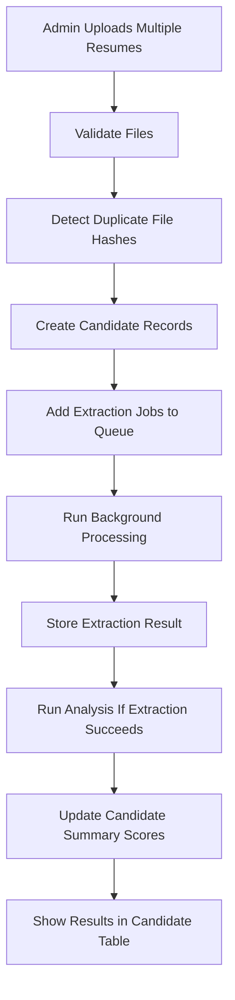
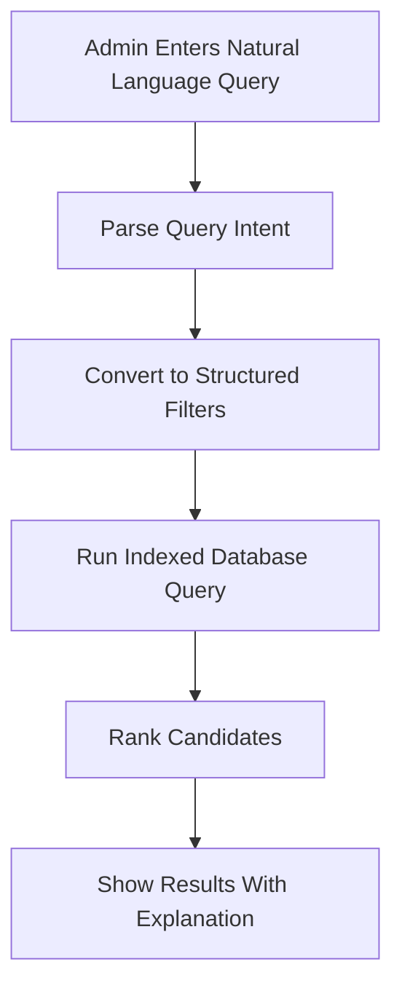
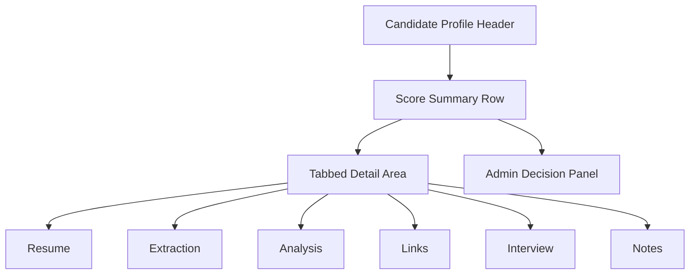
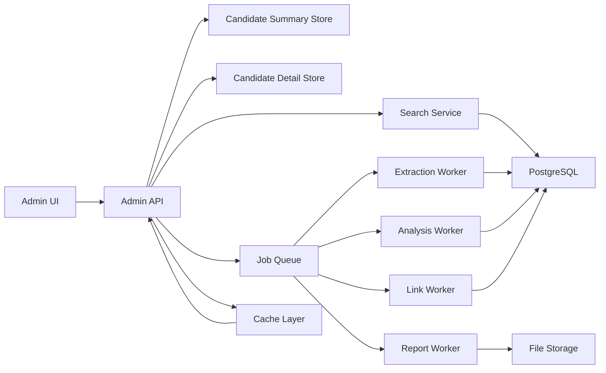
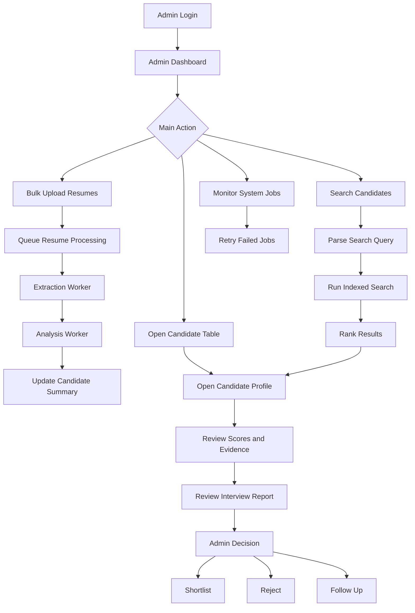

# Admin Module: High-Level Features, Flow, and Optimized Logic

## 1. Admin Module Goal

The admin module is the control center of RViewer AI.

Its purpose is to help admins, recruiters, HR teams, placement officers, and mentors manage candidates at scale without manually reading every resume from start to finish.

The admin should be able to:

- Upload and manage candidates.
- Process resumes in bulk.
- Search candidates using filters or natural language.
- Review AI extraction, analysis, link verification, roadmap, and interview results.
- Compare candidates for a role.
- Shortlist, reject, or mark candidates for follow-up.
- Monitor failed jobs, system health, and AI usage.

The admin system should be high-level, fast, and optimized. Heavy AI work should not run repeatedly when the same resume, link, or report already exists.

## 2. Core Admin Principles

### 2.1 Reduce Manual Work

Admins should not repeatedly open every resume manually. The system should summarize, rank, filter, and highlight important issues.

### 2.2 Reduce System Load

The platform should avoid unnecessary repeated processing.

Optimization rules:

- Do not re-extract the same resume if the file hash already exists.
- Do not re-run link verification if links were checked recently.
- Do not regenerate interview reports unless transcript or scoring logic changed.
- Do not run roadmap generation for admin views unless required.
- Load candidate table data from precomputed summary fields.
- Run heavy jobs in background queues.
- Cache external platform data where possible.

### 2.3 Keep Admin Pages Fast

Admin dashboards should show summaries first, then load deeper details only when the admin opens a candidate.

Fast-loading data:

- Candidate name
- Target role
- Resume score
- ATS score
- Link score
- Interview score
- Candidate status
- Last activity

Lazy-loaded data:

- Full extracted JSON
- Full resume preview
- Full GitHub heatmap
- Full LeetCode topic analysis
- Full transcript
- PDF report preview

### 2.4 Evidence-Based Decisions

Every admin decision should be supported by evidence:

- Resume score
- ATS score
- Role fit score
- Project quality
- Verified links
- Interview score
- Transcript summary
- Admin notes

## 3. Admin Feature List

## 3.1 Admin Dashboard

The admin dashboard gives a high-level overview of all candidate activity.

Dashboard cards:

- Total candidates
- New candidates
- Resumes uploaded
- Resumes processed
- Pending processing jobs
- Failed jobs
- Average ATS score
- Average role fit score
- Average interview score
- Candidates shortlisted
- Candidates needing review

Dashboard charts:

- Candidates by target role
- Average score by role
- Processing status chart
- Interview completion trend
- Link verification health
- Skill distribution chart

Dashboard tables:

- Recent candidates
- Highest scoring candidates
- Candidates with failed processing
- Candidates needing admin review
- Recent interview reports

## 3.2 Candidate Management

Admins can view, filter, and manage all candidates.

Candidate table columns:

- Candidate name
- Email
- Phone
- Target role
- Resume status
- ATS score
- Role fit score
- Link score
- Interview score
- Pipeline status
- Last updated

Candidate actions:

- View profile
- View original resume
- View extracted data
- View analysis
- View links
- View interview report
- Download report
- Add note
- Shortlist
- Reject
- Mark follow-up
- Reprocess resume
- Recheck links
- Request interview

Optimization:

- Candidate table should use stored summary scores, not calculate scores live.
- Filtering should use indexed database fields.
- Large JSON fields should be loaded only inside candidate detail pages.

## 3.3 Bulk Resume Upload

Admins can upload many resumes at the same time.

Bulk upload flow:



Bulk upload status:

- Waiting
- Validating
- Duplicate
- Queued
- Extracting
- Analyzing
- Completed
- Failed
- Needs review

Load reduction:

- Use file hash to skip duplicate resumes.
- Process jobs asynchronously.
- Limit simultaneous AI calls.
- Retry failed jobs with backoff.
- Store failure reasons.
- Let admin retry only failed candidates.

## 3.4 Natural Language Candidate Search

Admins can search using plain English.

Example queries:

- "Show React candidates with GitHub projects."
- "Find full-stack interns with ATS score above 80."
- "Show candidates with LeetCode above 300 solved problems."
- "Find Python and machine learning candidates with good interview scores."
- "Show candidates whose GitHub link is broken."
- "Find candidates with strong project score but weak communication."

Search flow:



Optimization:

- Convert natural language into database filters.
- Avoid sending every candidate profile to an LLM.
- Use LLM only for query parsing, not full search execution.
- Cache common parsed queries.
- Use indexed columns for score, role, skill, and status filters.

## 3.5 Candidate Profile Review

The candidate profile page is the full admin view of one candidate.

Sections:

- Candidate summary
- Original resume
- Extracted profile
- Resume analysis
- Link intelligence
- Roadmap summary
- Resume builder versions
- Interview reports
- Admin notes
- Candidate activity history

Recommended layout:



Optimization:

- Load the summary first.
- Load each tab only when opened.
- Cache report previews.
- Store admin notes separately from AI-generated data.

## 3.6 Resume Analysis Review

Admins can inspect resume quality without manually reading the whole document.

Analysis review includes:

- Overall resume score
- ATS score
- Section completeness
- Missing fields
- Weak bullets
- Skill gaps
- Project quality
- Role recommendations
- Improvement priorities

Admin use cases:

- Identify candidates with strong skills but weak resumes.
- Find candidates needing resume improvement.
- Compare candidates for a target role.
- Decide whether the candidate is ready for interview.

## 3.7 Link Intelligence Review

Admins can review whether the student's resume claims are supported by public links.

GitHub admin view:

- Profile status
- Contribution heatmap
- Current streak
- Public repositories
- Stars
- Forks
- Followers
- Most used languages
- Top repositories
- Resume project matches

LeetCode admin view:

- Total solved
- Easy solved
- Medium solved
- Hard solved
- Language counts
- Concept radar graph
- Algorithm coverage
- Resume claim match

Other links:

- LinkedIn
- Portfolio
- Certifications
- Project demos
- Blogs
- Research profiles

Optimization:

- Link checks should run as scheduled/background jobs.
- Store last checked timestamp.
- Do not recheck links on every page load.
- Use stale-while-refresh behavior: show cached result first, refresh in background.

## 3.8 Interview Management

Admins can manage and review candidate interviews.

Interview table columns:

- Candidate name
- Target role
- Interview status
- Interview date
- Duration
- Overall score
- Technical score
- Communication score
- Problem-solving score
- Report status

Admin actions:

- View report
- View transcript
- Download PDF
- Add notes
- Request re-interview
- Mark interview passed
- Mark interview failed

Optimization:

- Store score summaries separately from full transcript.
- Load transcript only when requested.
- Generate reports in background.
- Allow report regeneration only when needed.

## 3.9 Shortlisting Pipeline

Admins can move candidates through a hiring or placement pipeline.

Pipeline stages:

- New
- Resume uploaded
- Processing
- Analyzed
- Interview pending
- Interview completed
- Shortlisted
- Rejected
- Follow-up required
- Hired

Pipeline view:

- Kanban board
- Table view
- Role-wise pipeline
- Score-wise pipeline

Admin actions:

- Drag candidate between stages.
- Add reason for rejection.
- Add follow-up note.
- Assign candidate to recruiter.
- Export shortlisted candidates.

## 3.10 Comparison Tool

Admins should be able to compare candidates side by side.

Comparison fields:

- ATS score
- Role fit score
- Skill match
- Project score
- GitHub evidence
- LeetCode evidence
- Interview score
- Communication score
- Strengths
- Weaknesses
- Admin notes

Use case:

When multiple candidates apply for the same role, the admin can compare them without switching between many pages.

## 3.11 Reports and Export

Admins can export data for internal review.

Export options:

- Candidate profile PDF
- Interview report PDF
- Shortlisted candidate CSV
- Role-wise candidate list
- Failed processing report
- Link verification report

Optimization:

- Generate large exports in background.
- Notify admin when export is ready.
- Store generated exports temporarily.

## 3.12 User and Role Management

Admins can manage users and permissions.

Roles:

- Student
- Recruiter
- Admin
- Super admin

Permissions:

- View candidates
- Upload resumes
- View reports
- Download reports
- Manage users
- Manage system settings
- Retry failed jobs
- Delete candidates

## 3.13 System Monitoring

Admins can monitor platform health.

Monitoring areas:

- Resume extraction jobs
- Link verification jobs
- Interview sessions
- Report generation jobs
- Failed AI calls
- Provider latency
- Queue length
- Storage usage
- API rate limits
- Cost estimates

System monitor should show:

- Service status
- Job status
- Error logs summary
- Retry buttons
- Provider usage
- Average processing time

## 4. Optimized Admin Architecture



## 5. Admin Load Reduction Strategy

### 5.1 Precompute Summary Fields

Store these values on candidate summary records:

- Overall resume score
- ATS score
- Role fit score
- Link score
- Interview score
- Top skills
- Target role
- Processing status
- Last updated

This prevents the candidate list page from opening and parsing full JSON repeatedly.

### 5.2 Background Processing

Heavy work should run outside the request-response cycle.

Background jobs:

- Resume extraction
- Resume analysis
- Link verification
- GitHub data fetching
- LeetCode data fetching
- Interview evaluation
- PDF generation
- CSV export generation

### 5.3 Caching

Cache:

- Link verification results
- GitHub profile stats
- LeetCode profile stats
- Candidate search results
- Dashboard metrics
- Report previews

Cache invalidation rules:

- Resume changed: refresh extraction and analysis.
- Links changed: refresh link verification.
- Interview completed: refresh interview score.
- Admin manually requests refresh: re-run selected job.

### 5.4 Lazy Loading

Admin pages should load only what is needed.

Candidate list:

- Load summary only.

Candidate profile:

- Load selected tab details.

Interview report:

- Load transcript only if opened.

Link intelligence:

- Load GitHub heatmap only when the GitHub tab is opened.

### 5.5 Indexed Filtering

Frequently filtered fields should be indexed:

- Target role
- ATS score
- Role fit score
- Interview score
- Link score
- Status
- Skills
- Created date
- Updated date

## 6. Admin End-to-End Flow



## 7. Admin UI Structure

### 7.1 Sidebar

Sidebar pages:

- Dashboard
- Candidates
- Bulk Upload
- Search
- Interviews
- Reports
- Pipeline
- Compare
- Users
- Monitoring
- Settings

### 7.2 Top Bar

Top bar:

- Global search
- Notifications
- Processing status
- Admin profile
- Workspace selector

### 7.3 Dashboard Layout

Dashboard structure:

- Summary cards at top
- Charts in middle
- Recent activity and failed jobs at bottom
- Quick actions on the right

### 7.4 Candidate Table Layout

Candidate table should support:

- Search
- Filters
- Sorting
- Multi-select
- Bulk actions
- Saved views
- Export

Filter examples:

- Role
- Skills
- Status
- ATS score
- Interview score
- Link score
- Upload date
- Resume processed status

### 7.5 Candidate Detail Layout

Candidate detail should include:

- Header with candidate name and status
- Score summary row
- Admin decision panel
- Tabs for resume, extraction, analysis, links, interview, roadmap, notes

## 8. Admin Decision Logic

Admin decisions should combine AI scores and human judgment.

Suggested decision signals:

- Strong resume score
- Strong role fit
- Verified projects
- Active GitHub
- Good LeetCode evidence when relevant
- Strong interview score
- Clear communication
- No major claim mismatch

Decision outputs:

- Shortlisted
- Rejected
- Follow-up required
- Re-interview required
- Needs resume improvement

The platform should never automatically reject candidates without admin review. It can recommend, rank, and flag, but the final decision should remain human-controlled.

## 9. Admin Data Model

```json
{
  "admin_user": {
    "admin_id": "",
    "name": "",
    "email": "",
    "role": "admin | recruiter | super_admin",
    "permissions": []
  },
  "candidate_summary": {
    "candidate_id": "",
    "name": "",
    "email": "",
    "target_role": "",
    "top_skills": [],
    "resume_score": 0,
    "ats_score": 0,
    "role_fit_score": 0,
    "link_score": 0,
    "interview_score": 0,
    "status": "",
    "processing_status": "",
    "last_updated": ""
  },
  "admin_action": {
    "action_id": "",
    "candidate_id": "",
    "admin_id": "",
    "action": "shortlist | reject | follow_up | note_added | retry_job | request_interview",
    "note": "",
    "created_at": ""
  }
}
```

## 10. Important Admin Product Rules

1. Admin routes must be role-protected.
2. Candidate lists must use precomputed summary fields.
3. Heavy AI work must run in background jobs.
4. Duplicate resumes must be detected using file hash.
5. Natural language search should convert text into database filters.
6. Full candidate JSON, transcripts, and reports should be lazy-loaded.
7. Link verification should use cached results and refresh only when needed.
8. Admin decisions must be stored with timestamps and notes.
9. Failed jobs must be visible and retryable.
10. AI can recommend candidates, but admin makes the final decision.
11. Candidate private data must be protected with strict access control.
12. Reports and exports should be generated in background to avoid slow admin pages.
