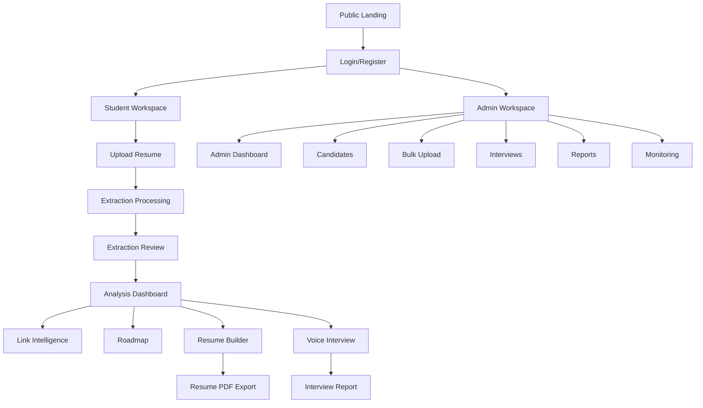
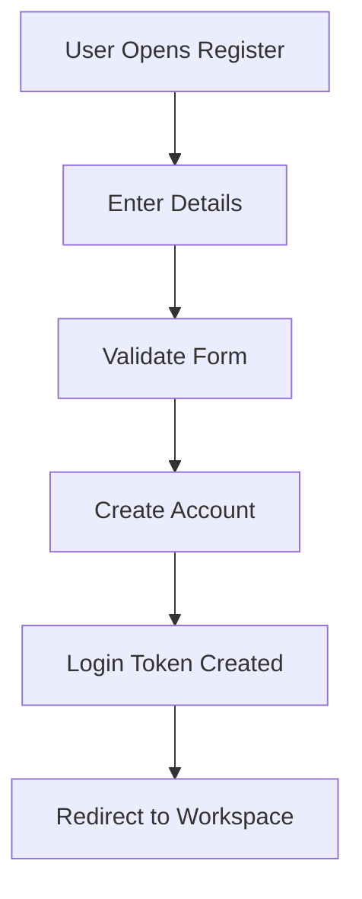
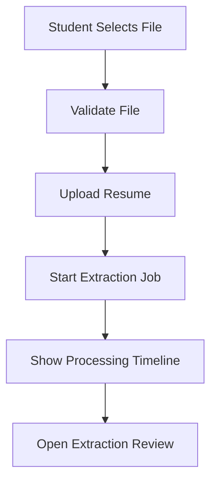
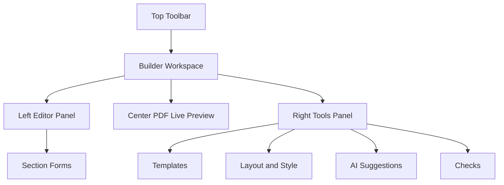
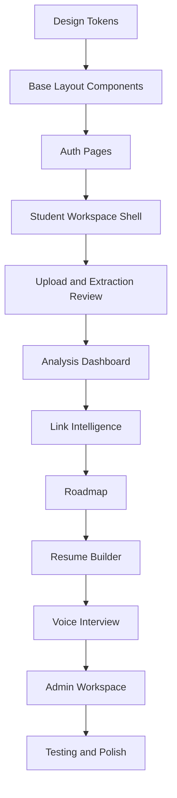
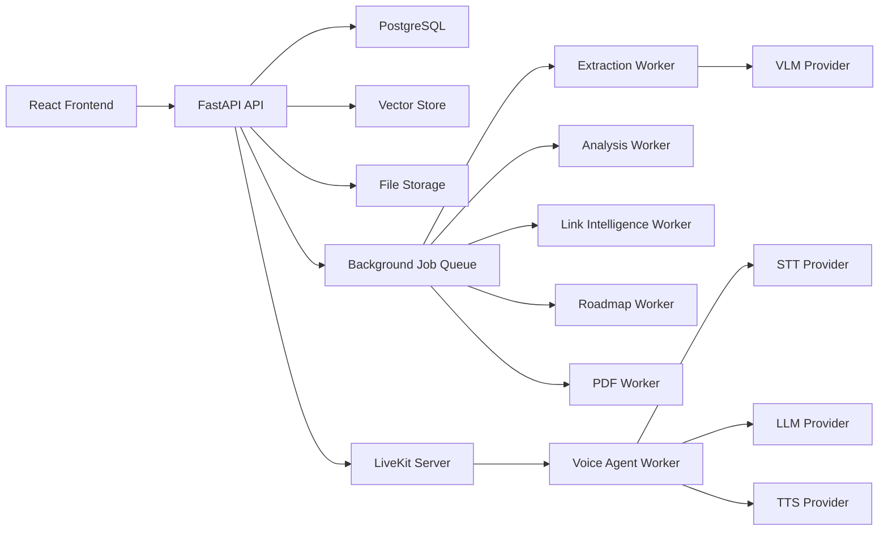
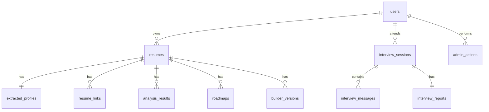

# RViewer AI Implementation, UI, Architecture, Endpoints, and Data Build Spec

## 1. Purpose

This document describes how to build RViewer AI from a product, UI, frontend, backend, database, and implementation-flow perspective.

It is not a generic AI SaaS template. The product should feel custom, warm, intelligent, and resume-focused. Avoid the usual template look: no sharp dark sidebar-only dashboard pattern, no generic top search bar copied across every page, no meaningless oversized cards, no random gradient blobs, and no layout that looks like a stock admin panel.

The experience should feel like a serious career intelligence workspace:

- Light, calm, and polished for normal student/admin pages.
- Editor-like and tool-heavy for the Resume Builder.
- Dark, focused, and cinematic for the Voice Interview room.

## 2. Visual Direction

### 2.1 Color Palette

Use white as the main application background. The provided palette should support the interface through soft panels, highlights, status areas, and secondary surfaces.

```css
:root {
  --white: #ffffff;
  --tea-green: #ccd5ae;
  --beige: #e9edc9;
  --cornsilk: #fefae0;
  --papaya-whip: #faedcd;
  --light-bronze: #d4a373;
  --black: #050505;
  --soft-black: #141414;
  --red: #e5483f;
  --orange: #f08a24;
  --blue: #2563eb;
}
```

### 2.2 Color Usage

Main background:

- Use `--white` as the main background for most pages.
- Use `--cornsilk` as a soft warm page tint only in selected areas, not as the full default background.
- Use `--beige` for quiet section backgrounds, upload zones, roadmap panels, and empty states.
- Use `--tea-green` for success, progress, verified states, completed steps, and calm highlights.
- Use `--papaya-whip` for tips, helper panels, soft warnings, and secondary callouts.
- Use `--light-bronze` for primary call-to-action accents, selected states, score emphasis, and warm highlights.
- Use `--black` or `--soft-black` for important icons, dark buttons, strong headers, interview controls, and high-emphasis surfaces.
- When using black icon/surface blocks, use light font colors such as white, cornsilk, beige, or tea green for contrast.
- Use red for destructive actions, failed jobs, broken links, interview end actions, and critical warnings.
- Use orange for medium warnings, pending review, processing states, and attention markers.
- Use blue for information, active links, selected navigation states, and voice/interview signal accents.

Recommended additional neutral colors:

```css
:root {
  --ink: #1f1d1a;
  --muted-ink: #6f6a5f;
  --line: #dfd8bf;
  --paper: #fffdf1;
  --white: #ffffff;
  --black: #050505;
  --soft-black: #141414;
  --danger: #e5483f;
  --warning: #f08a24;
  --info: #2563eb;
  --success: #637a46;
  --interview-bg: #050607;
  --interview-grid: rgba(255, 255, 255, 0.07);
  --interview-cyan: #24d9f2;
  --interview-red: #ff6b63;
}
```

### 2.3 Page Color Rules

Normal pages:

- Background: white.
- Cards: white or paper-like with very soft warm borders.
- Borders: soft beige line.
- Buttons: bronze, dark ink, or black depending on importance.
- Success: tea green.
- Warning: papaya whip with bronze text.
- Information: blue text or blue icon on white/paper surface.
- Critical errors: red text, red border, or pale red surface.
- Icons: use black for neutral/action icons, bronze for primary actions, tea green for success, blue for information, orange for warnings, and red for destructive actions.
- Dark icon tiles or black buttons must always use light text/icons.

Dark black UI usage:

- Use black carefully as an accent, not as the full normal-page background.
- Good uses: primary buttons, icon buttons, selected compact tools, export buttons, interview controls, admin danger confirmations.
- Text on black: white, cornsilk, beige, tea green, or cyan.
- Do not place muted gray text on black if contrast is weak.

Resume Builder:

- Workspace can be light neutral, closer to the screenshots.
- Editor panels should be compact and tool-like.
- Resume preview should feel like a real page on a desk.
- Template panel should be visual, not a plain list.
- Black can be used for the strongest toolbar action such as Download PDF.
- Left and right panels should remain white/paper with clean black text and warm accent states.

Interview Page:

- Use a separate dark theme.
- Full-screen black/dark grid background.
- Cyan audio indicators.
- Red end-interview action.
- Minimal visible UI.

## 3. Typography

### 3.1 Font Direction

Use a modern, friendly, readable sans-serif type system.

Recommended:

- Main UI font: `Inter`, `Manrope`, `Plus Jakarta Sans`, or another clean sans-serif.
- Default product typography should be sans-serif everywhere.
- Display serif fonts should be avoided in the app shell. They may be used only inside specific resume templates where the template design requires it.
- Resume preview templates may use different template-specific fonts.

### 3.2 Type Scale

```css
--text-xs: 12px;
--text-sm: 14px;
--text-base: 16px;
--text-lg: 18px;
--text-xl: 22px;
--text-2xl: 28px;
--text-3xl: 36px;
```

Rules:

- Do not use huge headings inside dashboards.
- Use compact headings for tool surfaces.
- Keep letter spacing normal except small uppercase labels.
- Avoid negative letter spacing.
- Use strong font weight only where it helps scanning.
- Use sans-serif fonts for login, dashboard, admin, builder controls, roadmap, links, and interview UI.
- Keep form labels, table text, and dashboard metrics highly readable.

## 4. Core Layout Philosophy

### 4.1 Avoid Generic Dashboard Layout

Do not make every page:

- Left sharp sidebar
- Top search bar
- Four generic cards
- Repeated chart blocks

Instead, use page-specific layouts.

Examples:

- Upload page should feel like a guided document intake.
- Extraction page should feel like a review and correction workspace.
- Analysis dashboard should feel like a career health board.
- Link intelligence should feel like proof-of-work verification.
- Roadmap should feel like a six-month learning planner.
- Resume builder should feel like an editor.
- Interview room should feel like a dedicated live session.
- Admin pages should feel operational and dense, but still warm.

### 4.2 Spacing and Shape

Use:

- 8px radius for normal cards and panels.
- 12px radius only for large soft panels.
- 999px radius only for pills, toggles, status chips, and circular controls.
- Consistent 24px to 32px outer page padding on desktop.
- 16px page padding on mobile.

Avoid:

- Nested cards inside cards.
- Overly rounded rectangles everywhere.
- Decorative background orbs.
- Purple-blue default AI gradients.
- Crowded UI with overlapping text.

## 5. App Information Architecture



## 6. Frontend Tech Stack

Use React with a clean component structure.

Recommended stack:

- React
- TypeScript
- Vite
- React Router
- Zustand or TanStack Query for state/data
- Axios or fetch wrapper
- Tailwind CSS
- Framer Motion for small transitions
- Recharts for graphs
- Mermaid for generated diagrams/mind maps
- LiveKit React components for voice interview
- React Hook Form with Zod for forms
- html2canvas / react-pdf / backend PDF generation depending on export strategy

## 7. Backend Tech Stack

Recommended backend:

- FastAPI
- Python
- SQLAlchemy ORM
- Alembic migrations
- PostgreSQL
- Qdrant or FAISS for resume/interview retrieval
- Background worker system
- LiveKit server and LiveKit agents
- Provider abstraction for LLM, VLM, STT, TTS
- File storage for uploads, page images, exports, and reports

## 8. Recommended Folder Structure

```text
client/
  src/
    app/
      router.tsx
      routes.ts
    components/
      common/
      layout/
      upload/
      extraction/
      analysis/
      links/
      roadmap/
      builder/
      interview/
      admin/
      charts/
      ui/
    pages/
      public/
      auth/
      workspace/
      admin/
    lib/
      api.ts
      authApi.ts
      resumeApi.ts
      analysisApi.ts
      linksApi.ts
      roadmapApi.ts
      builderApi.ts
      interviewApi.ts
      adminApi.ts
    stores/
      authStore.ts
      resumeStore.ts
      analysisStore.ts
      builderStore.ts
      interviewStore.ts
      adminStore.ts
    styles/
      tokens.css
      globals.css
    types/

server/
  app/
    api/
      v1/
        auth.py
        resumes.py
        extraction.py
        analysis.py
        links.py
        roadmap.py
        builder.py
        interview.py
        admin.py
    core/
      extraction/
      analysis/
      links/
      roadmap/
      builder/
      interview/
      ai/
      storage/
      jobs/
    models/
    schemas/
    db/
    services/
    utils/
  uploads/
  data/
    page_images/
    vector_store/
    outputs/
  templates/
```

## 9. Page-by-Page UI Build Description

## 9.1 Landing Page

Goal:

Introduce the product clearly without looking like a generic AI landing page.

Layout:

- Warm full-width background using `--cornsilk`.
- Product name as the first strong visual signal.
- Primary action: upload resume or create account.
- Short visual product flow strip: Upload, Analyze, Verify, Build, Interview.
- No fake 3D blobs or generic AI artwork.

Components:

- Navbar
- Product hero
- Workflow preview
- Feature bands
- Student/admin split
- Footer

## 9.2 Login Page

Goal:

Make login feel calm, trustworthy, and fast.

Layout:

- Two-column desktop layout.
- Left side: product identity, small resume intelligence illustration or workflow.
- Right side: login form on clean paper panel.
- Mobile: single column.

Components:

- Email input
- Password input
- Login button
- Register link
- Forgot password
- Role-aware redirect after login

Visual style:

- Background `--cornsilk`.
- Form surface `--paper`.
- Primary button dark ink or bronze.
- Avoid generic glassmorphism.

## 9.3 Register Page

Components:

- Name
- Email
- Password
- Confirm password
- Role selection if allowed
- Terms checkbox
- Register button

Flow:



## 9.4 Student Workspace Home

Goal:

Show where the student is in the career workflow.

Components:

- Resume status
- Latest analysis score
- Next best action
- Active roadmap progress
- Interview readiness card
- Resume builder quick action
- Recent reports

Layout:

- No hard sidebar dependency.
- Use a soft top workspace navigation with section tabs.
- Main content can use wide panels with calm spacing.

## 9.5 Resume Upload Page

Components:

- Upload dropzone
- Supported file labels
- File validation messages
- Upload progress
- Processing timeline
- Recent uploads

Flow:



## 9.6 Extraction Review Page

Goal:

Let the student confirm extracted resume data before analysis.

Layout:

- Left: section list and confidence status.
- Center: editable extracted fields.
- Right: original resume preview or field evidence.

Components:

- Personal details editor
- Education editor
- Skills editor
- Projects editor
- Experience editor
- Certifications editor
- Links editor
- Low-confidence field badges
- Confirm and analyze button

## 9.7 Analysis Dashboard

Goal:

Give career intelligence, not just charts.

Components:

- Resume health score
- ATS score
- Role fit score
- Link verification score
- AI summary
- Section completeness
- Skill intelligence
- Skill gap analysis
- Project analysis
- Bullet quality analyzer
- Warning list
- Improvement priorities

Layout:

- Header with active resume and target role.
- Score row with four main metrics.
- Main area split by meaning, not generic card count.
- Tabs for deep details.

## 9.8 Link Intelligence Page

Components:

- Overall link verification score
- Platform status cards
- GitHub contribution heatmap
- GitHub repo table
- GitHub stars/forks/followers/contributions
- LeetCode radar chart
- LeetCode difficulty chart
- Language usage bars
- Portfolio checker
- Certification checker
- Broken link warnings

Layout:

- Top summary strip.
- Platform cards.
- Detailed tabs by platform.
- GitHub heatmap should visually resemble GitHub.
- LeetCode concept radar should be central in the LeetCode tab.

## 9.9 Roadmap Page

Goal:

Show a six-month plan based on the resume and target role.

Components:

- Target role header
- Six-month timeline
- Weekly task checklist
- Skill dependency graph
- Certification recommendations
- Project milestones
- Progress tracker
- Resource list
- Roadmap regenerate button

Layout:

- Left: months timeline.
- Center: selected month/week detail.
- Right: certifications, resources, progress.

## 9.10 Resume Builder Page

The Resume Builder is a special page. It should not look like the normal dashboard.

Visual reference:

- Image 1 shows a professional editor with left section editor, center PDF preview, right template gallery, and top toolbars.
- Image 2 shows a step-by-step resume builder with section steps on top, form inputs on the left, and live preview on the right.

Recommended final builder structure:

- Top toolbar
- Step navigation
- Left editor panel
- Center live PDF preview
- Right template/style/AI panel

### Resume Builder Layout



### Top Toolbar

Components:

- Back button
- Resume title
- Editable version name
- Save status
- Undo
- Redo
- Resume score
- PDF preview toggle
- Download PDF button

### Step Navigation

Steps:

1. Personal
2. Summary
3. Work Experience
4. Education
5. Skills
6. Projects
7. Analyze
8. Publish

Step behavior:

- Show current step as a filled circle.
- Allow section reordering for work experience, education, skills, and projects.
- Keep personal, summary, and publish fixed.

### Left Editor Panel

Use compact editable sections.

Components:

- Section heading
- Tips and recommendations strip
- Text inputs
- Textareas
- Add item button
- Sort/reorder
- AI suggestions button
- Match score per job title where relevant

Fields:

- Personal info
- Summary
- Work experience
- Education
- Skills
- Projects
- Certifications
- Achievements
- Links

### Center PDF Preview

Requirements:

- A4 page preview.
- Accurate PDF spacing.
- Clickable text areas where possible.
- Zoom control.
- Page navigation.
- Overflow warning.
- White paper on warm neutral workspace.

### Right Tools Panel

Tabs:

- Templates
- Style
- AI
- Score
- Job Match

Template cards:

- Thumbnail
- Template name
- Template category
- Color swatches
- Selected state

Style controls:

- Accent color
- Font
- Font size
- Margins
- Section spacing
- One-column/two-column layout
- Header style

AI controls:

- Improve selected bullet
- Improve all weak bullets
- Rewrite summary
- Add metrics
- Make ATS-friendly
- Make target-role-specific

Builder rule:

Changing a template must shift the user's content into the new layout without deleting data.

## 9.11 Voice Interview Lobby

Goal:

Prepare the student for a resume-based voice interview.

Components:

- Active resume card
- Target role confirmation
- Interview type
- Duration
- Microphone check
- Speaker check
- Start interview button
- Warning if no resume is selected

## 9.12 Voice Interview Room

The interview room is a special page and should not use the light theme.

Visual reference:

- Image 3 shows a minimal cyan audio pulse style.
- Image 4 shows the desired dark interview screen with grid background, timer, connection pill, center waveform, ready state, and red end button.

Layout:

- Full-screen dark page.
- Subtle grid background.
- Top-left interview label and AI interviewer name.
- Top-right timer and connected status.
- Center waveform/audio pulse.
- Center state text: Ready, Listening, Thinking, Speaking.
- Bottom-center end interview button.

Components:

- Room audio renderer
- Timer
- Connection status pill
- Current phase label
- Waveform
- Speaking/listening/thinking state
- Mic state
- End interview button

Do not add a normal sidebar, dashboard cards, or top search to this page.

## 9.13 Interview Report Page

Components:

- Overall score
- Radar chart
- Score breakdown
- Phase-wise summary
- Transcript
- Strengths
- Areas for improvement
- Download PDF
- Send recommendations to roadmap

## 9.14 Admin Dashboard

Admin pages can be denser but still should follow the warm visual identity.

Components:

- Candidate counts
- Processing status
- Average scores
- Failed jobs
- Recent candidates
- Interview reports
- Shortlist activity

## 9.15 Admin Candidate Table

Components:

- Candidate list
- Filters
- Sort
- Status chips
- Score columns
- Bulk actions
- Saved views

Avoid a huge top search bar. Search can be a compact tool in the table header.

## 9.16 Admin Candidate Profile

Components:

- Candidate summary header
- Score row
- Admin decision panel
- Tabs: Resume, Extraction, Analysis, Links, Interview, Notes
- Download report
- Shortlist/reject/follow-up actions

## 10. Transitions and Motion

Motion should be meaningful, not decorative.

Use transitions for:

- Page enter fade and slight rise.
- Step changes in builder.
- Analysis processing progress.
- Score count-up.
- Link verification status update.
- Roadmap month selection.
- Interview waveform.

Avoid:

- Bouncy page transitions.
- Excessive hover motion.
- Slow animations.
- Decorative loops outside interview/audio states.

Recommended motion:

```text
Page transition: 160-220ms
Panel transition: 120-180ms
Score animation: 500-800ms
Builder preview update: instant to 120ms
Interview waveform: continuous while active
```

## 11. Build Flow



Implementation order:

1. Set color tokens, typography, spacing, and base components.
2. Build auth and workspace routing.
3. Build resume upload and extraction review.
4. Build analysis dashboard with mock data first.
5. Build link intelligence visual components.
6. Build roadmap timeline and checklist.
7. Build resume builder editor and preview.
8. Build interview lobby and dark room.
9. Build admin pages.
10. Connect endpoints.
11. Add loading, empty, error, and retry states.

## 12. System Architecture



## 13. Main Backend Endpoints

### 13.1 Auth

| Method | Endpoint | Purpose |
|---|---|---|
| `POST` | `/api/v1/auth/register` | Create account |
| `POST` | `/api/v1/auth/login` | Login and return token |
| `GET` | `/api/v1/auth/me` | Current user |
| `POST` | `/api/v1/auth/logout` | Logout |

### 13.2 Resume and Extraction

| Method | Endpoint | Purpose |
|---|---|---|
| `POST` | `/api/v1/resumes/upload` | Upload resume |
| `GET` | `/api/v1/resumes` | List user resumes |
| `GET` | `/api/v1/resumes/{resume_id}` | Get resume summary |
| `GET` | `/api/v1/resumes/{resume_id}/file` | Download original resume |
| `POST` | `/api/v1/extraction/{resume_id}/start` | Start extraction |
| `GET` | `/api/v1/extraction/{resume_id}/status` | Extraction status |
| `GET` | `/api/v1/extraction/{resume_id}` | Get extracted JSON |
| `PATCH` | `/api/v1/extraction/{resume_id}` | Update corrected extracted data |
| `POST` | `/api/v1/extraction/{resume_id}/confirm` | Confirm extraction |

### 13.3 Analysis

| Method | Endpoint | Purpose |
|---|---|---|
| `POST` | `/api/v1/analysis/{resume_id}/start` | Start analysis |
| `GET` | `/api/v1/analysis/{resume_id}` | Get full analysis |
| `GET` | `/api/v1/analysis/{resume_id}/dashboard` | Dashboard summary |
| `GET` | `/api/v1/analysis/{resume_id}/ats` | ATS details |
| `GET` | `/api/v1/analysis/{resume_id}/skills` | Skill analysis |
| `GET` | `/api/v1/analysis/{resume_id}/projects` | Project analysis |
| `GET` | `/api/v1/analysis/{resume_id}/roles` | Role recommendations |

### 13.4 Links

| Method | Endpoint | Purpose |
|---|---|---|
| `POST` | `/api/v1/links/{resume_id}/verify` | Start link verification |
| `GET` | `/api/v1/links/{resume_id}` | Link summary |
| `GET` | `/api/v1/links/{resume_id}/github` | GitHub intelligence |
| `GET` | `/api/v1/links/{resume_id}/leetcode` | LeetCode intelligence |
| `GET` | `/api/v1/links/{resume_id}/platforms/{platform}` | Platform-specific result |

### 13.5 Roadmap

| Method | Endpoint | Purpose |
|---|---|---|
| `POST` | `/api/v1/roadmap/{resume_id}/generate` | Generate six-month roadmap |
| `GET` | `/api/v1/roadmap/{resume_id}` | Get roadmap |
| `PATCH` | `/api/v1/roadmap/{roadmap_id}/progress` | Update progress |
| `POST` | `/api/v1/roadmap/{roadmap_id}/regenerate` | Regenerate roadmap |

### 13.6 Resume Builder

| Method | Endpoint | Purpose |
|---|---|---|
| `GET` | `/api/v1/builder/templates` | List templates |
| `POST` | `/api/v1/builder/{resume_id}` | Create builder version |
| `GET` | `/api/v1/builder/{builder_id}` | Get builder state |
| `PATCH` | `/api/v1/builder/{builder_id}` | Save builder edits |
| `POST` | `/api/v1/builder/{builder_id}/ai-improve` | Improve selected content |
| `POST` | `/api/v1/builder/{builder_id}/export-pdf` | Export PDF |
| `GET` | `/api/v1/builder/{builder_id}/exports` | Export history |

### 13.7 Interview

| Method | Endpoint | Purpose |
|---|---|---|
| `POST` | `/api/v1/interview/start` | Start interview session |
| `GET` | `/api/v1/interview/token` | Get LiveKit token |
| `POST` | `/api/v1/interview/end-interview` | End session and start report |
| `GET` | `/api/v1/interview/session-status/{room_name}` | Session status |
| `GET` | `/api/v1/interview/session/{room_name}` | Full session |
| `GET` | `/api/v1/interview/download-report/{room_name}` | Download report |
| `GET` | `/api/v1/interview/history` | Interview history |

### 13.8 Admin

| Method | Endpoint | Purpose |
|---|---|---|
| `GET` | `/api/v1/admin/dashboard` | Admin dashboard metrics |
| `GET` | `/api/v1/admin/candidates` | Candidate list |
| `GET` | `/api/v1/admin/candidates/{candidate_id}` | Candidate detail |
| `POST` | `/api/v1/admin/bulk-upload` | Bulk resume upload |
| `POST` | `/api/v1/admin/search` | Natural language candidate search |
| `PATCH` | `/api/v1/admin/candidates/{candidate_id}/status` | Update pipeline status |
| `POST` | `/api/v1/admin/candidates/{candidate_id}/notes` | Add admin note |
| `GET` | `/api/v1/admin/jobs` | Background job list |
| `POST` | `/api/v1/admin/jobs/{job_id}/retry` | Retry failed job |

## 14. Database Schema

### 14.1 Main Tables



### 14.2 Users

```sql
CREATE TABLE users (
  id UUID PRIMARY KEY,
  name TEXT NOT NULL,
  email TEXT UNIQUE NOT NULL,
  password_hash TEXT NOT NULL,
  role TEXT NOT NULL,
  status TEXT NOT NULL DEFAULT 'active',
  created_at TIMESTAMP NOT NULL,
  updated_at TIMESTAMP NOT NULL
);
```

### 14.3 Resumes

```sql
CREATE TABLE resumes (
  id UUID PRIMARY KEY,
  user_id UUID REFERENCES users(id),
  filename TEXT NOT NULL,
  file_path TEXT NOT NULL,
  file_hash TEXT NOT NULL,
  file_type TEXT NOT NULL,
  page_count INTEGER,
  raw_text TEXT,
  status TEXT NOT NULL,
  active BOOLEAN NOT NULL DEFAULT false,
  created_at TIMESTAMP NOT NULL,
  updated_at TIMESTAMP NOT NULL
);
```

### 14.4 Extracted Profiles

```sql
CREATE TABLE extracted_profiles (
  id UUID PRIMARY KEY,
  resume_id UUID REFERENCES resumes(id),
  profile_json JSONB NOT NULL,
  confidence_json JSONB,
  missing_fields JSONB,
  warnings JSONB,
  confirmed BOOLEAN NOT NULL DEFAULT false,
  created_at TIMESTAMP NOT NULL,
  updated_at TIMESTAMP NOT NULL
);
```

### 14.5 Analysis Results

```sql
CREATE TABLE analysis_results (
  id UUID PRIMARY KEY,
  resume_id UUID REFERENCES resumes(id),
  overall_score INTEGER,
  ats_score INTEGER,
  role_fit_score INTEGER,
  link_score INTEGER,
  analysis_json JSONB NOT NULL,
  created_at TIMESTAMP NOT NULL,
  updated_at TIMESTAMP NOT NULL
);
```

### 14.6 Resume Links

```sql
CREATE TABLE resume_links (
  id UUID PRIMARY KEY,
  resume_id UUID REFERENCES resumes(id),
  url TEXT NOT NULL,
  normalized_url TEXT,
  platform TEXT,
  link_type TEXT,
  source TEXT,
  page_number INTEGER,
  verification_status TEXT,
  intelligence_json JSONB,
  last_checked_at TIMESTAMP,
  created_at TIMESTAMP NOT NULL
);
```

### 14.7 Roadmaps

```sql
CREATE TABLE roadmaps (
  id UUID PRIMARY KEY,
  resume_id UUID REFERENCES resumes(id),
  target_role TEXT NOT NULL,
  duration_months INTEGER NOT NULL DEFAULT 6,
  roadmap_json JSONB NOT NULL,
  progress_json JSONB,
  created_at TIMESTAMP NOT NULL,
  updated_at TIMESTAMP NOT NULL
);
```

### 14.8 Builder Versions

```sql
CREATE TABLE builder_versions (
  id UUID PRIMARY KEY,
  resume_id UUID REFERENCES resumes(id),
  user_id UUID REFERENCES users(id),
  template_id TEXT NOT NULL,
  version_name TEXT,
  content_json JSONB NOT NULL,
  style_json JSONB NOT NULL,
  section_order JSONB,
  hidden_sections JSONB,
  export_pdf_path TEXT,
  created_at TIMESTAMP NOT NULL,
  updated_at TIMESTAMP NOT NULL
);
```

### 14.9 Interview Sessions

```sql
CREATE TABLE interview_sessions (
  id UUID PRIMARY KEY,
  user_id UUID REFERENCES users(id),
  resume_id UUID REFERENCES resumes(id),
  room_name TEXT UNIQUE NOT NULL,
  candidate_name TEXT NOT NULL,
  target_role TEXT,
  status TEXT NOT NULL,
  current_phase TEXT,
  exchange_count INTEGER DEFAULT 0,
  start_time TIMESTAMP NOT NULL,
  end_time TIMESTAMP,
  evaluation_json JSONB,
  report_pdf_path TEXT,
  created_at TIMESTAMP NOT NULL,
  updated_at TIMESTAMP NOT NULL
);
```

### 14.10 Interview Messages

```sql
CREATE TABLE interview_messages (
  id UUID PRIMARY KEY,
  session_id UUID REFERENCES interview_sessions(id),
  role TEXT NOT NULL,
  content TEXT NOT NULL,
  phase TEXT NOT NULL,
  timestamp TIMESTAMP NOT NULL,
  audio_duration_seconds FLOAT,
  transcription_confidence FLOAT
);
```

### 14.11 Admin Actions

```sql
CREATE TABLE admin_actions (
  id UUID PRIMARY KEY,
  admin_id UUID REFERENCES users(id),
  candidate_id UUID REFERENCES users(id),
  action TEXT NOT NULL,
  note TEXT,
  metadata JSONB,
  created_at TIMESTAMP NOT NULL
);
```

### 14.12 Background Jobs

```sql
CREATE TABLE background_jobs (
  id UUID PRIMARY KEY,
  job_type TEXT NOT NULL,
  entity_type TEXT NOT NULL,
  entity_id UUID NOT NULL,
  status TEXT NOT NULL,
  attempts INTEGER NOT NULL DEFAULT 0,
  error_message TEXT,
  result_json JSONB,
  created_at TIMESTAMP NOT NULL,
  updated_at TIMESTAMP NOT NULL
);
```

## 15. ORM Model List

Recommended SQLAlchemy ORM models:

- `User`
- `Resume`
- `ExtractedProfile`
- `ResumeLink`
- `AnalysisResult`
- `Roadmap`
- `BuilderVersion`
- `InterviewSession`
- `InterviewMessage`
- `InterviewReport`
- `AdminAction`
- `BackgroundJob`

ORM rules:

- Keep large JSON fields in detail tables, not summary tables.
- Use indexed summary fields for admin/candidate list pages.
- Store timestamps on every main model.
- Keep file paths in DB but actual files in storage.
- Use JSONB for flexible AI outputs.
- Validate JSON outputs with Pydantic schemas before saving.

## 16. Frontend Component Inventory

### 16.1 Common UI

- `Button`
- `IconButton`
- `Input`
- `Textarea`
- `Select`
- `Tabs`
- `Dialog`
- `Drawer`
- `Toast`
- `StatusChip`
- `ScoreBadge`
- `ProgressBar`
- `EmptyState`
- `ErrorState`
- `LoadingState`

### 16.2 Layout

- `PublicLayout`
- `AuthLayout`
- `StudentWorkspaceLayout`
- `AdminWorkspaceLayout`
- `BuilderWorkspaceLayout`
- `InterviewRoomLayout`

### 16.3 Resume and Extraction

- `ResumeDropzone`
- `UploadProgress`
- `ProcessingTimeline`
- `ExtractionSectionList`
- `ExtractionFieldEditor`
- `ResumePreview`
- `ConfidenceBadge`

### 16.4 Dashboard

- `ResumeHealthCard`
- `ATSScoreCard`
- `RoleFitCard`
- `LinkScoreCard`
- `AISummaryPanel`
- `SectionCompleteness`
- `SkillMatrix`
- `SkillGapPanel`
- `ProjectAnalysisList`
- `BulletQualityList`
- `ImprovementPriorityList`

### 16.5 Links

- `PlatformStatusCard`
- `GitHubHeatmap`
- `GitHubRepoTable`
- `GitHubStatsRow`
- `LeetCodeRadar`
- `DifficultyDonut`
- `LanguageUsageBar`
- `LinkWarningList`

### 16.6 Roadmap

- `RoadmapTimeline`
- `MonthPlan`
- `WeekChecklist`
- `SkillDependencyGraph`
- `CertificationCard`
- `ResourceList`
- `RoadmapProgress`

### 16.7 Builder

- `BuilderTopBar`
- `BuilderStepper`
- `BuilderEditorPanel`
- `BuilderPreview`
- `TemplateGallery`
- `StylePanel`
- `AISuggestionPanel`
- `BuilderChecksPanel`
- `PDFZoomControls`
- `SectionReorderControl`

### 16.8 Interview

- `InterviewLobby`
- `MicCheck`
- `InterviewRoom`
- `AudioWaveform`
- `InterviewTimer`
- `ConnectionPill`
- `PhaseLabel`
- `EndInterviewButton`
- `InterviewReport`
- `RadarScoreChart`
- `TranscriptViewer`

### 16.9 Admin

- `AdminMetricCard`
- `CandidateTable`
- `CandidateFilters`
- `BulkUploadPanel`
- `CandidateProfileHeader`
- `AdminDecisionPanel`
- `InterviewReportViewer`
- `JobMonitorTable`
- `PipelineBoard`

## 17. Build Logic Notes

These are implementation reasoning notes, not hidden chain-of-thought.

1. Build design tokens first so every page follows the same visual language.
2. Build the normal app theme and interview theme separately.
3. Keep Resume Builder outside the normal dashboard layout because it is an editor.
4. Keep Interview Room outside the normal dashboard layout because it is a live session.
5. Use summary endpoints for dashboards and tables.
6. Use detail endpoints only when the user opens a specific record or tab.
7. Store AI outputs as JSONB but validate them with schemas.
8. Use background workers for expensive processing.
9. Add mock data screens before integrating each backend module.
10. Add empty, loading, failed, retry, and partial-success states for every AI workflow.

## 18. Final UI Rules

- Normal pages use white as the main background, with the warm palette used for supporting panels and highlights.
- Resume Builder follows the editor-style reference images.
- Interview Room follows the dark grid/audio reference images.
- Avoid generic SaaS sidebars on special pages.
- Avoid repeated top search bars on every page.
- Use page-specific headers and actions.
- Make every page useful on first load.
- Do not show raw AI complexity to the student.
- Show confidence, warnings, and next actions clearly.
- Keep the product feeling calm, serious, and custom-built.
- Use sans-serif typography as the default across the application.
- Use black for strong icons, primary dark buttons, and high-emphasis controls; always pair black surfaces with light text.
- Use red, orange, and blue intentionally for destructive, warning, and information states.
